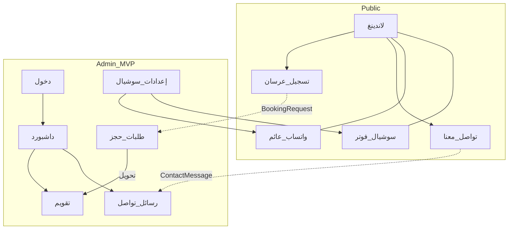

# قائمة الصفحات المحتملة — منصة استوديو الراية

> مصنّفة حسب السطح والأولوية.  
> **MVP** = مطلوبة للإطلاق الأول · **V2** = لاحقاً · **اختياري** = حسب حاجة العميل

---

## أ) الموقع العام (Public)

| # | الصفحة | المسار المقترح | الأولوية | الوظيفة |
|---|--------|----------------|----------|---------|
| 1 | الصفحة الرئيسية / لاندينغ | `/` | MVP | براند + صورة بطل + CTA حجز + سوشيال في الفوتر |
| 2 | تسجيل / حجز عرسان | `/book` | MVP | نموذج → `BookingRequest` |
| 3 | تأكيد الإرسال (حجز) | `/book/thanks` | MVP | رسالة نجاح بعد التسجيل |
| 4 | تواصل معنا | `/contact` | **MVP** | نموذج → `ContactMessage` يظهر في لوحة التحكم |
| 5 | تأكيد الإرسال (تواصل) | `/contact/thanks` | MVP | رسالة نجاح بعد التواصل |
| 6 | خدماتنا | `/services` | V2 | عرض أنواع المناسبات/الباقات |
| 7 | باقة / تفاصيل خدمة | `/services/[slug]` | V2 | تفاصيل سعر ووصف |
| 8 | أعمال / معرض | `/portfolio` | V2 | صور/فيديو أعمال الاستوديو |
| 9 | من نحن | `/about` | V2 | قصة الاستوديو + الشعار اللفظي |
| 10 | الأسئلة الشائعة FAQ | `/faq` | V2 | تقليل المكالمات المتكررة |
| 11 | سياسة الخصوصية | `/privacy` | اختياري | قانوني |
| 12 | الشروط | `/terms` | اختياري | قانوني |
| 13 | بوابة الزبون (متابعة مناسبتي) | `/my-event` | V3 | تتبع حالة بعد الحجز |

### مكوّنات عامة على صفحات الموقع (ليست صفحات منفصلة)

| المكوّن | الأولوية | الوصف |
|---------|----------|--------|
| زر واتساب عائم (Floating) | **MVP** | زر ثابت (يفضّل أسفل-يسار مع RTL) يفتح `https://wa.me/{رقم}` مع رسالة افتراضية اختيارية |
| أيقونات التواصل الاجتماعي | **MVP** | فوتر (+ اختياري هيدر): واتساب، إنستغرام، فيسبوك، تيك توك، يوتيوب، سناب — تُفعَّل من الإعدادات |
| تواصل سريع في الفوتر | MVP | `tel:` + واتساب + إيميل إن وُجد |

---

## ب) المصادقة (Admin Auth)

| # | الصفحة | المسار المقترح | الأولوية |
|---|--------|----------------|----------|
| 12 | تسجيل دخول الإدارة | `/admin/login` | MVP |
| 13 | نسيت كلمة المرور | `/admin/forgot-password` | V2 |
| 14 | تعيين كلمة مرور جديدة | `/admin/reset-password` | V2 |
| 15 | الملف الشخصي / تغيير كلمة المرور | `/admin/profile` | V2 |

---

## ج) لوحة الإدارة — التشغيل اليومي

| # | الصفحة | المسار المقترح | الأولوية | مرجع NexLink / وميض |
|---|--------|----------------|----------|---------------------|
| 16 | لوحة المؤشرات (Dashboard) | `/admin` | MVP | NexLink Dashboard + بطاقات وميض |
| 17 | **التقويم / المواعيد** | `/admin/calendar` | **MVP — الأهم** | [NexLink Calendar](https://nexlink.layoutdrop.com/demo/calendar.html) |
| 18 | طلبات التسجيل (Inbox) | `/admin/bookings` | MVP | Leads |
| 19 | تفاصيل طلب تسجيل | `/admin/bookings/[id]` | MVP | قبول / رفض / تحويل |
| 20 | رسائل تواصل معنا | `/admin/messages` | **MVP** | Inbox لرسائل `/contact` |
| 21 | تفاصيل رسالة | `/admin/messages/[id]` | MVP | قراءة + تعليم كمقروءة / أرشفة |
| 22 | الزبائن | `/admin/customers` | MVP | Customers |
| 23 | إضافة/تعديل زبون | `/admin/customers/new` أو Modal | MVP | |
| 24 | تفاصيل زبون | `/admin/customers/[id]` | V2 | مناسباته ودفعاته |
| 25 | المناسبات | `/admin/events` | MVP | قائمة + فلتر حالة |
| 26 | تفاصيل مناسبة | `/admin/events/[id]` | MVP | خدمات، دفعات، خصومات |
| 27 | خدمات المناسبة | `/admin/event-services` | V2 | قائمة تشغيلية |
| 28 | الخدمات (كتالوج) | `/admin/services` | MVP | عرس، حنا… |
| 29 | أنواع/باقات الخدمة | `/admin/services/[id]/offers` | MVP | الأسعار |
| 30 | الخدمات الفردية | `/admin/sub-services` | V2 | كاميرا، طباعة… |
| 31 | الدفعات | `/admin/payments` أو داخل المناسبة | MVP | تقرير + تسجيل |
| 32 | الخصومات | داخل المناسبة | MVP | |
| 33 | البحث العام | من الهيدر | V2 | بحث مناسبات/زبائن |
| 34 | إعدادات الموقع والسوشيال | `/admin/settings/site` | **MVP** | روابط السوشيال + رقم واتساب العائم + هاتف/إيميل ظاهر للعامة |

---

## د) لوحة الإدارة — الفريق والصلاحيات

| # | الصفحة | المسار المقترح | الأولوية |
|---|--------|----------------|----------|
| 35 | الموظفين | `/admin/employees` | V2 |
| 36 | الأدوار والصلاحيات | `/admin/roles` | V2 |
| 37 | مناسباتي (مهام الموظف) | `/admin/my-assignments` | V2 |
| 38 | تعيين مصور على خدمة | من تفاصيل المناسبة | V2 |

---

## هـ) التقارير

| # | الصفحة | المسار المقترح | الأولوية |
|---|--------|----------------|----------|
| 39 | تقرير المناسبات | `/admin/reports/events` | V2 |
| 40 | تقرير الدفعات / التحصيلات | `/admin/reports/payments` | V2 |
| 41 | تقرير الخصومات | `/admin/reports/discounts` | V2 |
| 42 | تقرير خدمات الموظفين | `/admin/reports/staff` | V2 |
| 43 | تقرير العروض/الباقات | `/admin/reports/offers` | V2 |
| 44 | تصدير Excel / PDF | أزرار داخل التقارير | V2 |

---

## و) الإعدادات

| # | الصفحة | المسار المقترح | الأولوية |
|---|--------|----------------|----------|
| 45 | إعدادات عامة | `/admin/settings` | MVP مبسّط |
| 46 | إعدادات الموقع والسوشيال | `/admin/settings/site` | **MVP** (نفس بند 34 أعلاه) |
| 47 | التعريفات (Lookups) | `/admin/lookups` | V2 |
| 48 | الفروع | `/admin/branches` | V3 |

---

## ز) نقطة البيع (لاحقاً)

| # | الصفحة | المسار المقترح | الأولوية |
|---|--------|----------------|----------|
| 49 | شاشة البيع | `/admin/pos` | V3 |
| 50 | الأصناف | `/admin/pos/categories` | V3 |
| 51 | المنتجات | `/admin/pos/products` | V3 |
| 52 | طلبات الشراء | `/admin/pos/purchases` | V3 |
| 53 | تقرير نقاط البيع | `/admin/reports/pos` | V3 |

---

## ح) SMS وتنبيهات (لاحقاً)

| # | الصفحة | المسار المقترح | الأولوية |
|---|--------|----------------|----------|
| 54 | الرسائل القصيرة / سجل SMS | `/admin/sms` | V3 |
| 55 | قوالب الرسائل | ضمن الإعدادات | V3 |

---

## تدفق «تواصل معنا» → لوحة التحكم

```
الزائر يفتح /contact
  → يعبّئ: الاسم، الهاتف، الإيميل(اختياري)، الموضوع، الرسالة
  → يُنشأ ContactMessage (status = NEW)
  → يظهر في /admin/messages + عدّاد غير مقروء في الهيدر/الداشبورد
  → الموظف يفتح الرسالة → READ
  → يرد عبر واتساب/اتصال (خارج النظام في MVP) أو يؤرشف ARCHIVED
```

**ملاحظة:** طلبات الحجز (`BookingRequest`) منفصلة عن رسائل التواصل (`ContactMessage`).

---

## ملخص أولوية MVP فقط (ما يبنيه المبرمج أولاً)

### Public
1. `/` لاندينغ (+ فوتر سوشيال + زر واتساب عائم)  
2. `/book` تسجيل عرسان  
3. `/book/thanks`  
4. `/contact` تواصل معنا  
5. `/contact/thanks`  

### Admin
6. `/admin/login`  
7. `/admin` داشبورد (يشمل عدّاد رسائل جديدة)  
8. `/admin/calendar` **تقويم المواعيد**  
9. `/admin/bookings` (+ تفاصيل)  
10. `/admin/messages` (+ تفاصيل) ← رسائل التواصل  
11. `/admin/customers`  
12. `/admin/services` (+ عروض)  
13. `/admin/events` (+ تفاصيل / دفعات / خصومات)  
14. `/admin/settings` + `/admin/settings/site` (سوشيال + واتساب)  

---

## اقتراحات إضافية موصى بها (ليست مطلباً من العميل بعد)

| الاقتراح | الأولوية المقترحة | لماذا مفيد لاستوديو الراية |
|----------|-------------------|------------------------------|
| FAQ `/faq` | V2 | إجابات عن الباقات، العربون، التسليم تقلل المكالمات |
| معرض أعمال `/portfolio` | V2 | يقنع العرسان قبل الحجز — مناسب لهوية الشعار الفاخرة |
| خريطة موقع / موقع القاعة على صفحة التواصل | V2 | إن كان للاستوديو عنوان زيارة |
| إشعار صوتي/بادج في الأدمن عند رسالة أو طلب جديد | MVP خفيف | لا تفوت الإدارة أي lead |
| فتح واتساب من تفاصيل الرسالة برقم الزائر معبّأ مسبقاً | MVP | رد سريع من Inbox |
| Google Business / رابط التقييمات في الفوتر | V2 | ثقة اجتماعية |
| حظر إرسال مكرر (honeypot / rate limit) على `/contact` و`/book` | MVP | منع السبام |
| صفحة «الباقات الشائعة» مختصرة على اللاندينغ | MVP محتوى | بدون صفحة منفصلة أولاً |
| إشعار إيميل للإدارة عند رسالة جديدة | V2 | إن توفر SMTP |
| وضع صيانة بسيط | اختياري | عند الإطلاق أو التحديث |

---

## خريطة مبسّطة


