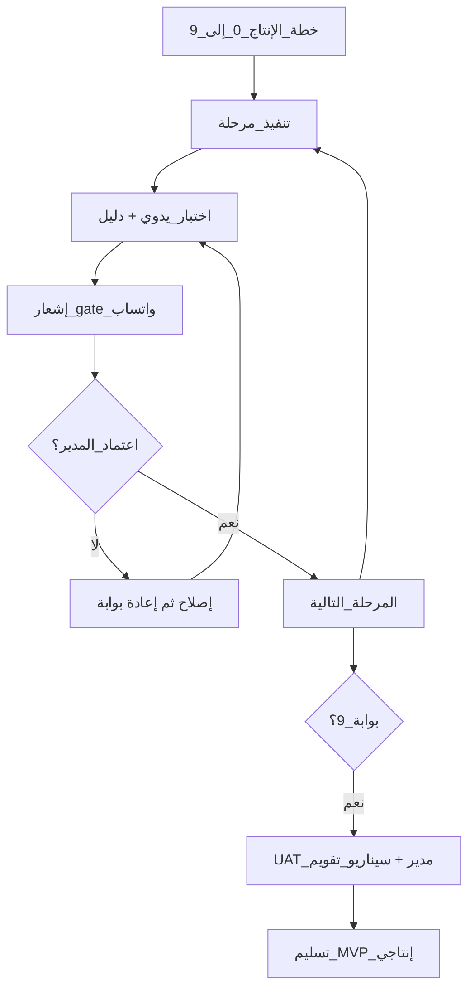

# مراقبة الجودة ومتابعة العمل — دليل مدير المشروع
## استوديو الراية · بيت البرمجيات وتكنولوجيا المعلومات

> أنت: **مصطفى البستنجي** — مدير الشركة + مدير المشروع  
> المهندسة المنفّذة: **نهلة البستنجي**
> الهدف: منتج **إنتاجي** (MVP مغلق ببوابات) بجودة يمكن الدفاع عنها أمام العميل

---

## 1) مبدأ الإدارة باختصار

| السؤال | الجواب المعتمد عندنا |
|--------|----------------------|
| متى نعتبر العمل «منتهياً»؟ | هيكل كامل + تدفق بيانات مغلق + اختبار يدوي ناجح + إشعار واتساب |
| ما الأهم في المنتج؟ | **ظهور الحجوزات على التقويم** |
| كيف نمنع الهدر؟ | مرحلة واحدة، لا قفز، لا أزرار صامتة |
| كيف تراقب وأنت مشغول؟ | إشعارات واتساب + سجل بوابات في الخطة |

المراجع الملزمة للمبرمج:

- [production-work-plan.md](./production-work-plan.md)
- [whatsapp-pm-notifications.md](./whatsapp-pm-notifications.md)
- [developer-handoff.md](./developer-handoff.md)

---

## 2) أدوار واضحة (RACI مختصر)

| البند | أنت (مدير) | المبرمج |
|--------|------------|---------|
| أولويات المراحل | يقرّر ويغيّر الخطة | ينفّذ حسب الترتيب |
| جودة التنفيذ التقني | يراجع عند البوابة | مسؤول أول |
| الاختبار اليدوي | يطالب بالإثبات | ينفّذ ويبلّغ |
| قبول الانتقال لمرحلة تالية | **يعتمد** بعد `gate` واتساب | يطلب الاعتماد |
| التواصل مع العميل | أنت | لا يعد بميزات خارج الخطة |
| المفاتيح/الاستضافة/Wasender | أنت | يستخدم `.env` فقط |

قاعدة ذهبية: **المبرمج لا ينتقل لمرحلة تالية إلا بعد رسالتك أو اعتماد بوابة ناجحة وصلت واتساباً.**

---

## 3) إيقاع متابعة أسبوعي (عملي)

### يومياً (5–10 دقائق)
- راقب واتساب: `session-start` / `task` / `gate` / `session-end`
- إن وصلت بوابة `pass false` → لا نقاش انتقال؛ اطلب سبب + موعد إعادة اختبار
- إن مرّ يوم عمل بدون أي إشعار مرحلة/مهمة → اسأل: «ما حالة المرحلة الحالية؟»

### مرتين أسبوعياً (مكالمة 15–20 دقيقة)
1. أي مرحلة نحن فيها؟  
2. ماذا أُغلق باختبار يدوي؟  
3. هل التقويم يعرض الحجوزات الحقيقية؟  
4. هل توجد أزرار ظاهرة غير شغّالة؟  
5. ماذا سيُغلق قبل الاجتماع القادم؟

### أسبوعياً (مراجعة جودة)
- افتح بنفسك (أو مع المبرمج بمشاركة شاشة):
  - لاندينغ + `/book` + `/contact` (عند جاهزيتها)
  - `/admin/calendar` ← **تحقق شخصي أن الحجوزات ظاهرة**
  - Inbox الحجوزات والرسائل
- قارن ما تراه مع آخر `gate` واتساب

---

## 4) نظام مراقبة الجودة (Quality Gates)

اعتمد نفس بوابات [production-work-plan.md](./production-work-plan.md) كعقد جودة:

```
بناء → اختبار يدوي مكتوب → إشعار gate واتساب → اعتمادك → المرحلة التالية
```

### بطاقة قبول سريعة لكل مرحلة (Checklist المدير)

- [ ] وصلني إشعار واتساب `gate` للمرحلة N
- [ ] مكتوب صراحة: اختبار يدوي pass أو fail
- [ ] إن pass: طلبت/شاهدت دليلاً (سكرين أو مشاركة شاشة) خاصة للتقويم
- [ ] لا ميزات «نصف جاهزة» ظاهرة للمستخدم
- [ ] المرحلة التالية لم تبدأ قبل اعتمادي

### دليل مطلوب من المبرمج عند بوابة مهمة (خصوصاً 5 و 7 و 9)
1. سكرين التقويم وفيه حجوزات حقيقية  
2. سكرين بعد Refresh لنفس الحجوزات  
3. جملة واحدة: مسار البيانات (من أين جاء الموعد → DB → التقويم)

بدون دليل مرئي على التقويم = **لا اعتماد** حتى لو قال «خلصت».

---

## 5) مؤشرات بسيطة (لا تعقّد)

تابع أسبوعياً 5 أرقام فقط:

| المؤشر | ماذا يعني |
|--------|-----------|
| رقم المرحلة الحالية | تقدّم الخطة 0→9 |
| بوابات ناجحة هذا الأسبوع | إيقاع إغلاق حقيقي |
| بوابات راسبة / مؤجلة | أين تتعثر الجودة |
| وجود حجوزات ظاهرة على التقويم؟ نعم/لا | قلب المنتج |
| عدد الأزرار الميتة المكتشفة | انضباط UI |

لا تحتاج Dashboard معقّد الآن — واتساب + ملف الخطة يكفي حتى الإطلاق.

---

## 6) اقتراحات لتعزيز الرقابة (مرتبة بالأولوية)

### أ) فوراً (بدون تكلفة تقريباً)
1. **قاعدة الاعتماد:** لا مرحلة تالية بلا `gate` واتساب + ردّك «معتمد» أو توقيع في سجل البوابات.  
2. **دليل مرئي إلزامي** للتقويم والحجز الأونلاين.  
3. **منع توسّع النطاق:** أي طلب جديد يُسجَّل في «لاحقاً» ولا يدخل المرحلة الحالية.  
4. **جلسة بداية/نهاية** تلقائية عبر Hooks — راقب ملخص الجلسة.

### ب) خلال أسبوعين
5. مجلد `docs/qa-evidence/` يضع فيه المبرمج سكرينات بأسماء: `phase-05-calendar.png`  
6. قائمة «عيوب مفتوحة» بسيطة في `docs/qa-open-issues.md` (رقم، شاشة، خطورة، حالة)  
7. تعريف **Definition of Done** مطبوع للمبرمج (نسخة من القانون الذهبي في خطة الإنتاج)

### ج) قبل تسليم العميل
8. يوم **UAT** معك: سيناريو عرسان كامل من اللاندينغ → تحويل → تقويم → دفعة → متبقي 0  
9. سيناريو تواصل معنا → رسالة في الأدمن  
10. تجربة موبايل للاندينغ وواتساب العائم  
11. قائمة إطلاق: لا روابط NexLink تجريبية، شعار الراية، Dark/RTL، أرقام سوشيال من الإعدادات

---

## 7) سيناريوهات المتابعة التي ننصحك بها شخصياً

### سيناريو A — متابعة يومية خفيفة (موصى به وأنت مدير شركة)
- تعتمد على واتساب فقط  
- اجتماعان قصيران أسبوعياً  
- تدخل بنفسك على التقويم كل أسبوع مرة

### سيناريو B — متابعة مشددة عند التعثّر
- كل بوابة تتطلب مشاركة شاشة 10 دقائق  
- أي fail يعاد في نفس اليوم أو بخطة مكتوبة لـ 24 ساعة  
- تجميد الميزات الجديدة حتى إغلاق المرحلة الحالية

### سيناريو C — قرب الإطلاق
- تجميد الكود 48 ساعة قبل التسليم إلا لإصلاح عيوب  
- اختبارك أنت كـ «زبون» + «موظف استوديو»  
- اعتماد نهائي مكتوب بعد سيناريو الحجوزات على التقويم

---

## 8) عبارات إدارة جاهزة (واتساب للمبرمج)

**طلب حالة:**  
«المهندسة الفاضلة نهلة، ما رقم المرحلة الحالية؟ وهل أُغلق آخر اختبار يدوي بإشعار gate؟»

**رفض انتقال مبكر:**  
«نشكر الاندفاع؛ الاعتماد يتم بعد بوابة الاختبار اليدوي وإشعار واتساب. التقويم وظهور الحجوزات جزء من شرط الإغلاق.»

**تشجيع بعد نجاح:**  
«أحسنتم على إغلاق المرحلة بدقة. نتابع بنفس الانضباط — جودة التحقّق اليدوي تصنع منتجاً إنتاجياً.»

---

## 9) الطريق إلى منتج إنتاجي (خريطة قرارك)



---

## 10) توصيتي التنفيذية لك الآن

1. اعتبر [production-work-plan.md](./production-work-plan.md) **عقد التنفيذ**.  
2. اعتبر واتساب **لوحة المراقبة**.  
3. لا تعتمد كلام «خلصت» بدون: `gate` + دليل تقويم عند اللزوم.  
4. ارفض أي عمل خارج المرحلة الحالية حتى تغلق.  
5. قبل تسليم العميل: يوم UAT واحد مركّز على **الحجز → التقويم → الدفع**.

بهذا تصل لمنتج إنتاجي بأقل اجتماعات وأعلى رقابة جودة — دون أن تتحول إلى مشرف تقني طوال اليوم.
