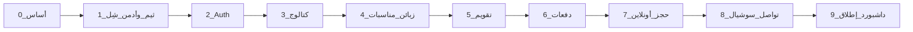

# خطة عمل الإنتاج — استوديو الراية

> إلزامية للمبرمج.  
> **لا تنتقل لمرحلة تالية** قبل إكمال الهيكل + تدفق البيانات + **اختبار يدوي ناجح** وتوقيع بوابة المرحلة.  
> المراجع: [developer-handoff.md](./developer-handoff.md) · [pages-inventory.md](./pages-inventory.md) · [data-model.md](./data-model.md) · [ui-nexlink-spec.md](./ui-nexlink-spec.md)

---

## الأهم على الإطلاق — الحجوزات على التقويم

**أي حجز/موعد له تاريخ يجب أن يظهر في `/admin/calendar`.**

| المصدر | يظهر على التقويم؟ |
|--------|-------------------|
| `EventService` (خدمة مناسبة بتواريخ) | **نعم — إلزامي** |
| مناسبة محوّلة من حجز أونلاين (`BookingRequest` → Event + EventService) | **نعم — إلزامي بعد التحويل** |
| موعد مُضاف من Modal التقويم نفسه | **نعم — إلزامي** |
| طلب حجز `PENDING` لم يُحوَّل بعد | لا (يبقى في Inbox فقط حتى التحويل) |

### قاعدة ذهبية للتقويم
- التقويم ليس شاشة تجميلية — هو **شاشة التشغيل اليومية**.
- إن أُنشئ موعد في DB ولم يظهر على FullCalendar = **فشل المرحلة** (4 أو 5 أو 7 حسب المصدر).
- بعد كل إنشاء/تعديل/تحويل: تحقق يدوياً أن الحدث ظاهر فوراً وبعد Refresh.
- عنوان الحدث واضح: مثلاً `عرس — اسم الزبون` مع الوقت والمكان في التفاصيل.

المراحل المرتبطة مباشرة: **4** (بيانات المواعيد) → **5** (عرض التقويم) → **7** (الحجز الأونلاين يغذي التقويم بعد التحويل).

---

## 0) القانون الذهبي (غير قابل للتفاوض)

1. **لا أزرار صامتة:** كل زر / رابط / أيقونة ظاهرة يجب أن يعمل أو يُخفى. ممنوع `href="#"` أو `console.log` كبديل لوظيفة.
2. **لا هيكل ناقص:** القائمة، الصفحات، النماذج، والـ CRUD المرتبطة بالمرحلة تكتمل داخل المرحلة نفسها.
3. **لا داتا فلو ناقص:** من الواجهة → التحقق → قاعدة MySQL → العرض مرة أخرى — مسار مغلق ومُختبر.
4. **اختبار يدوي بوابة:** بدون نجاح قائمة الاختبار اليدوي لا يُفتح العمل على المرحلة التالية.
5. **مرحلة واحدة في الوقت:** لا تخلط بناء مرحلة 5 بينما 3 غير مختبرة.
6. **وثّق النتيجة:** في نهاية كل مرحلة عبّئ جدول «بوابة المرحلة» أسفل القسم.
7. **أبلغ المدير واتساباً:** بعد كل بوابة اختبار يدوي شغّل `node tools/pm-notify.mjs gate ...` (انظر `docs/whatsapp-pm-notifications.md`). بدون إشعار = المرحلة غير مغلقة إدارياً.

### تعريف «منتهي» لعنصر UI

| الحالة | مسموح؟ |
|--------|--------|
| يعمل بالكامل ويحدّث DB أو ينقّل لصفحة حقيقية | نعم |
| مخفي حتى تُبنى وظيفته في مرحلة لاحقة | نعم (مع تعليق في الكود: `Phase N`) |
| ظاهر لكن لا يفعل شيئاً / modal فارغ / رابط ميت | **لا — رفض المرحلة** |

---

## خريطة المراحل



كل سهم = **اختبار يدوي ناجح + توقيع بوابة**.

---

## المرحلة 0 — تأسيس المشروع وقاعدة البيانات

### الهدف
مشروع Next.js يعمل محلياً + Prisma متصل بـ MySQL + جداول MVP فارغة جاهزة.

### الهيكل المطلوب
```
apps/web/          (أو جذر المشروع حسب اختيار السcaffold)
prisma/schema.prisma
.env               (DATABASE_URL — غير مرفوع)
docs/              (موجود مسبقاً — لا تحذف)
```

### تدفق البيانات
```
.env DATABASE_URL → Prisma Client → MySQL
migrate → جداول حسب docs/data-model.md (الحد الأدنى للكيانات المذكورة في المراحل 1–8)
```

### مخرجات إلزامية
- [x] `npm run dev` يعمل بدون أخطاء
- [x] `prisma migrate` ناجح على MySQL
- [x] `prisma generate` ناجح
- [x] ملف `.env.example` بدون أسرار

### اختبار يدوي — بوابة 0
| # | الاختبار | نتيجة (✓/✗) |
|---|----------|--------------|
| 0.1 | فتح التطبيق على localhost | ✓ |
| 0.2 | الاتصال بـ MySQL عبر Prisma (استعلام بسيط أو Studio) | ✓ |
| 0.3 | الجداول موجودة (Customer, Event, … حسب السكيمة الأولية) | ✓ |

**توقيع المبرمج:** نهلة البستنجي  **التاريخ:** 2026-08-12  
**إشعار واتساب `gate` أُرسل؟** نعم  
**الانتقال للمرحلة 1 مسموح؟** نعم  

تفاصيل الجلسة: [phase-0-completion.md](./phase-0-completion.md)

```bash
node tools/pm-notify.mjs gate --id 0 --pass true --manual-test pass --notes "أساس المشروع وMySQL جاهزان"
```

---

## المرحلة 1 — شِل الأدمن + الثيم (بدون بيانات عمل بعد)

### الهدف
لوحة إدارة بشكل NexLink كاملة الهيكل الظاهر: RTL + Light افتراضي + **زر theme-btn لـ Light/Dark** + شعار الراية + قائمة تنقل **كل روابطها تؤدي لصفحات موجودة** (حتى لو صفحة «قيد المرحلة» مؤقتة فقط إن كانت المرحلة الحالية لا تشملها — **الأفضل:** ابنِ الصفحات الهيكلية الفارغة برسالة واضحة «تُفعَّل في المرحلة X» بدل أزرار ميتة).

### الهيكل
- `app/(admin)/admin/layout.tsx` — shell
- صفحات placeholder مسمّاة لكل بند قائمة MVP (أو إخفاء البنود غير الجاهزة)
- أصول الثيم محلية — انظر `.cursor/rules/theme-setup.mdc`

### تدفق البيانات
```
المستخدم يفتح /admin/* → layout يحمّل CSS/JS الثيم
localStorage ←→ theme-btn (dark/light)
لا كتابة DB بعد في هذه المرحلة إلا إن لزم إعدادات ثابتة
```

### مخرجات إلزامية
- [x] `dir=rtl` + `lang=ar` + `data-theme=light`
- [x] خط الواجهة + primary `#5955D1` — **ملاحظة 2026-08-13:** الخط المعتمد الآن **Cairo** (راجع `admin-tables-ux.mdc`)
- [x] شعار استوديو الراية (ليس NexLink)
- [x] `theme-btn` يعمل ويحفظ التفضيل
- [x] لا طلبات إلى `nexlink.layoutdrop.com`
- [x] السايدبار: روابط MVP ظاهرة وتعمل (صفحات هيكلية برسالة المرحلة؛ الموظفون مؤجّلون حسب التوثيق)

### اختبار يدوي — بوابة 1
| # | الاختبار | نتيجة |
|---|----------|--------|
| 1.1 | الصفحة RTL بالكامل | ✓ |
| 1.2 | Light افتراضي بعد مسح التخزين | ✓ |
| 1.3 | تبديل Light/Dark ثم تحديث الصفحة يحافظ على الاختيار | ✓ |
| 1.4 | الشعار والنص = استوديو الراية | ✓ |
| 1.5 | كل رابط ظاهر في السايدبار يفتح صفحة حقيقية (لا 404 ولا #) | ✓ |
| 1.6 | لا أخطاء أصول CSS/JS ناقصة في الكونسول تتعلق بالثيم | ✓ |

**توقيع:** نهلة البستنجي  **التاريخ:** 2026-08-13  **انتقال؟** نعم  

تفاصيل: [phase-1-completion.md](./phase-1-completion.md)

---

## المرحلة 2 — المصادقة (Auth)

### الهدف
دخول/خروج حقيقي للموظفين مع حماية مسارات `/admin/*`.

### الهيكل
- `/admin/login`
- جلسة آمنة (NextAuth / Better Auth / ما يُعتمد في المشروع)
- مستخدم مدير في الـ seed
- Middleware: غير المسجّل → login

### تدفق البيانات
```
Login form → تحقق من User في MySQL → Session cookie
طلب /admin/* → middleware يفحص الجلسة
Logout → تدمير الجلسة → /admin/login
```

### مخرجات إلزامية
- [x] مستخدم seed: بريد + كلمة مرور موثّقة في README داخلي للمبرمج فقط
- [x] كلمة مرور خاطئة تُظهر خطأ واضح
- [x] بعد الدخول يذهب لـ `/admin` أو التقويم حسب القرار
- [x] زيارة `/admin/events` بدون جلسة تُرفض

### اختبار يدوي — بوابة 2
| # | الاختبار | نتيجة |
|---|----------|--------|
| 2.1 | دخول صحيح | ✓ |
| 2.2 | دخول خاطئ | ✓ |
| 2.3 | حماية المسارات | ✓ |
| 2.4 | تسجيل الخروج | ✓ |
| 2.5 | تحديث الصفحة يبقى مسجّلاً (إن كان مطلوباً) | ✓ |

**توقيع:** نهلة البستنجي  **التاريخ:** 2026-08-13  **انتقال؟** نعم  

تفاصيل: [phase-2-completion.md](./phase-2-completion.md)

---

## المرحلة 3 — الكتالوج (خدمات + باقات)

### الهدف
CRUD كامل للخدمات والعروض/الباقات — أساس الأسعار لاحقاً.

### الهيكل
- `/admin/services` قائمة + إضافة/تعديل/حذف (أو تعطيل)
- `/admin/services/[id]/offers` أو Modal عروض
- لا أزرار «حفظ» بدون كتابة DB

### تدفق البيانات
```
نموذج خدمة → Prisma Service → قائمة تتحدث فوراً
نموذج عرض → Prisma Offer مرتبط بـ serviceId → يظهر تحت الخدمة
حذف/تعطيل → ينعكس في القائمة وفي أي select لاحق
```

### مخرجات إلزامية
- [x] إنشاء / تعديل / عرض / حذف أو أرشفة خدمة
- [x] إنشاء عرض بسعر `Decimal` صحيح
- [x] تحقق حقول فارغة (لا حفظ ناقص)

### اختبار يدوي — بوابة 3
| # | الاختبار | نتيجة |
|---|----------|--------|
| 3.1 | إضافة خدمة تظهر في القائمة بعد الحفظ | ✓ |
| 3.2 | تعديل الاسم ينعكس فوراً | ✓ |
| 3.3 | إضافة باقة بسعر والتحقق من ظهورها | ✓ |
| 3.4 | محاولة حفظ بدون اسم = رفض مع رسالة | ✓ |
| 3.5 | لا زر صامت في شاشة الخدمات | ✓ |

**توقيع:** نهلة البستنجي  **التاريخ:** 2026-08-13  **انتقال؟** نعم  

تفاصيل: [phase-3-completion.md](./phase-3-completion.md)

---

## المرحلة 4 — الزبائن + المناسبات + خدمات المناسبة

### الهدف
دورة التشغيل الأساسية داخل الأدمن (بدون تقويم بعد وبدون حجز أونلاين).

### الهيكل
- `/admin/customers` CRUD كامل
- `/admin/events` قائمة + تفاصيل
- داخل المناسبة: إضافة EventService (خدمة + تواريخ + مكان + سعر)
- تغيير حالة المناسبة (تحضير / عمل / منتهية / ملغية)

### تدفق البيانات
```
Customer CRUD ↔ MySQL
Event(customerId, status, totalPrice) ↔ MySQL
EventService(eventId, serviceId, offerId?, startsAt, endsAt, venue, hall, price)
تحديث totalPrice عند إضافة/تعديل خدمات (قاعدة واضحة في الكود)
```

### مخرجات إلزامية
- [ ] زبون جديد يظهر في القائمة والتفاصيل
- [ ] مناسبة مربوطة بزبون
- [ ] خدمة مناسبة لها تواريخ حقيقية
- [ ] حالات المناسبة تعمل وتظهر في الفلتر
- [ ] كل أزرار التفاصيل (حفظ، إضافة خدمة، تغيير حالة) فعالة

### اختبار يدوي — بوابة 4
| # | الاختبار | نتيجة |
|---|----------|--------|
| 4.1 | إنشاء زبون كامل الحقول الإلزامية | ✓ |
| 4.2 | إنشاء مناسبة للزبون | ✓ |
| 4.3 | إضافة خدمتين بتواريخ مختلفة | ✓ |
| 4.4 | تغيير الحالة إلى قيد العمل ثم منتهية | ✓ |
| 4.5 | فلتر القائمة حسب الحالة | ✓ |
| 4.6 | تحديث الصفحة يحافظ على البيانات | ✓ |

**توقيع:** نهلة البستنجي  **التاريخ:** 2026-08-13  **انتقال؟** نعم  

تفاصيل: [phase-4-completion.md](./phase-4-completion.md)

---

## المرحلة 5 — التقويم (FullCalendar)

### الهدف
عرض وتشغيل المواعيد من `EventService` — **أهم شاشة**.

### الهيكل
- `/admin/calendar`
- عروض: شهر / أسبوع / يوم
- Modal إضافة/تعديل موعد يكتب في DB
- النقر على حدث يفتح تفاصيل حقيقية

### تدفق البيانات
```
EventService ←→ FullCalendar events JSON
إضافة من Modal → إنشاء/تحديث EventService (+ Event/Customer إن لزم حسب التصميم)
سحب/تعديل تاريخ (إن مُفعّل) → تحديث startsAt/endsAt في MySQL → إعادة ظهور صحيحة
```

### مخرجات إلزامية
- [x] كل EventService يظهر كحدث بعنوان مفهوم (خدمة — زبون)
- [x] إضافة موعد من التقويم تُنشئ سجلاً حقيقياً **ويظهر على نفس التقويم**
- [x] مناسبات المرحلة 4 ظاهرة 100٪ على التقويم (لا استثناءات صامتة)
- [x] RTL + ثيم Light/Dark على صفحة التقويم
- [x] لا أحداث وهمية ثابتة في الكود بعد الربط
- [x] بعد Refresh نفس الحجوزات ما زالت ظاهرة

### اختبار يدوي — بوابة 5
| # | الاختبار | نتيجة |
|---|----------|--------|
| 5.1 | **كل** خدمات المناسبة من المرحلة 4 ظاهرة على التقويم بالتاريخ الصحيح | ✓ |
| 5.2 | تبديل شهر/أسبوع/يوم يعمل والحجوزات تبقى منطقية | ✓ |
| 5.3 | إضافة موعد جديد يظهر فوراً وبعد Refresh | ✓ |
| 5.4 | فتح تفاصيل حدث موجود يعرض زبون/مكان/وقت حقيقيين | ✓ |
| 5.5 | لا أزرار صامتة (Add Event / التنقل / الإغلاق) | ✓ |
| 5.6 | مناسبة بتاريخ معروف — ابحث عنها على التقويم ووجدتها | ✓ |

**توقيع:** نهلة البستنجي  **التاريخ:** 2026-08-13  **انتقال؟** نعم  
**إشعار واتساب أُرسل؟** نعم

تفاصيل: [phase-5-completion.md](./phase-5-completion.md)

```bash
node tools/pm-notify.mjs gate --id 5 --pass true --manual-test pass --notes "كل الحجوزات ظاهرة على التقويم فوراً وبعد Refresh"
```

---

## المرحلة 6 — الدفعات والخصومات

### الهدف
تحصيل مالي كامل للمناسبة مع متبقي صحيح.

### الهيكل
- من تفاصيل المناسبة: قائمة دفعات + إضافة دفعة
- قائمة خصومات + إضافة خصم
- عرض: الإجمالي / الخصم / المدفوع / **المتبقي**

### تدفق البيانات
```
Payment(eventId, amount, paidAt) → Σ payments
Discount(eventId, amount) → Σ discounts
المتبقي = totalPrice - Σ discounts - Σ payments
(يُحسب في الخادم ويُعرض في الواجهة — مصدر واحد للحقيقة)
```

### مخرجات إلزامية
- [x] إضافة دفعة تحدّث المتبقي فوراً
- [x] إضافة خصم تحدّث المتبقي فوراً
- [x] منع مبالغ سالبة أو فارغة
- [x] بعد Refresh الأرقام نفسها

### اختبار يدوي — بوابة 6
| # | الاختبار | نتيجة |
|---|----------|--------|
| 6.1 | مناسبة بسعر 1000 → دفعة 300 → متبقي 700 | ✓ |
| 6.2 | خصم 50 → متبقي 650 | ✓ |
| 6.3 | دفعة تغطي الباقي → متبقي 0 | ✓ |
| 6.4 | رفض دفعة بمبلغ 0 أو سالب | ✓ |
| 6.5 | لا زر حفظ صامت | ✓ |

**توقيع:** نهلة البستنجي  **التاريخ:** 2026-08-13  **انتقال؟** نعم  
**إشعار واتساب أُرسل؟** نعم

تفاصيل: [phase-6-completion.md](./phase-6-completion.md)

---

## المرحلة 7 — الحجز الأونلاين (لاندينغ + Inbox)

### الهدف
مسار مغلق: زائر يسجّل → الإدارة تحوّل → مناسبة + تقويم.

### الهيكل
- `/` لاندينغ (هوية الراية) مع CTA يعمل
- `/book` + `/book/thanks`
- `/admin/bookings` + تفاصيل
- تحويل: إنشاء Customer + Event + EventService

### تدفق البيانات
```
/book form → BookingRequest(PENDING) → MySQL
Admin bookings list ← BookingRequest
إجراء «تحويل»:
  → Customer + Event(PREPARING) + EventService(تواريخ الطلب)
  → BookingRequest = CONVERTED + ربط IDs
  → يظهر في /admin/events وفي /admin/calendar
رفض → REJECTED مع ملاحظة
```

### مخرجات إلزامية
- [x] لا إرسال نموذج فارغ
- [x] الطلب يظهر في الأدمن خلال ثوانٍ
- [x] التحويل ينشئ بيانات كاملة لا سجلات يتيمة
- [x] بعد التحويل الموعد على التقويم
- [x] كل أزرار Inbox (تحويل/رفض/عرض) تعمل

### اختبار يدوي — بوابة 7
| # | الاختبار | نتيجة |
|---|----------|--------|
| 7.1 | إرسال حجز من /book → صفحة شكر | ✓ |
| 7.2 | ظهور الطلب في /admin/bookings بحالة PENDING | ✓ |
| 7.3 | تحويل الطلب → زبون + مناسبة موجودان | ✓ |
| 7.4 | **بعد التحويل الموعد ظاهر على `/admin/calendar` فوراً وبعد Refresh** | ✓ |
| 7.5 | رفض طلب آخر يعمل | ✓ |
| 7.6 | منع إرسال بدون هاتف/اسم | ✓ |
| 7.7 | حجزان محوّلان بتاريخين مختلفين — كلاهما ظاهران على التقويم | ✓ |

**توقيع:** نهلة البستنجي  **التاريخ:** 2026-08-14  **انتقال؟** نعم  
**إشعار واتساب أُرسل؟** نعم

تفاصيل: [phase-7-completion.md](./phase-7-completion.md)

```bash
node tools/pm-notify.mjs gate --id 7 --pass true --manual-test pass --notes "بعد التحويل الحجوزات ظاهرة على التقويم"
```

---

## المرحلة 8 — تواصل معنا + سوشيال + واتساب عائم

### الهدف
قناة استفسارات منفصلة عن الحجز + إعدادات موقع حية.

### الهيكل
- `/contact` + `/contact/thanks`
- `/admin/messages` + تفاصيل
- `/admin/settings/site`
- مكوّن واتساب عائم + فوتر سوشيال على الصفحات العامة

### تدفق البيانات
```
/contact → ContactMessage(NEW) → /admin/messages
فتح رسالة → READ
أرشفة → ARCHIVED
Settings.site → whatsapp_number / social_* → تُقرأ في اللاندينغ والفوتر والزر العائم
تغيير الرقم في الإعدادات → الزر العائم يستخدم الرقم الجديد فوراً (بدون إعادة نشر كود)
```

### مخرجات إلزامية
- [x] رسالة تظهر في الأدمن + عدّاد غير مقروء
- [x] واتساب العائم يفتح `wa.me` بالرقم من الإعدادات
- [x] أيقونة سوشيال بلا رابط = مخفية
- [x] لا خلط بين messages و bookings

### اختبار يدوي — بوابة 8
| # | الاختبار | نتيجة |
|---|----------|--------|
| 8.1 | إرسال /contact → يظهر في messages | ✓ |
| 8.2 | تعليم كمقروءة يزيل البادج | ✓ |
| 8.3 | تغيير رقم واتساب في الإعدادات يغيّر الزر العائم | ✓ |
| 8.4 | رابط إنستغرام يظهر؛ تركه فارغاً يخفي الأيقونة | ✓ |
| 8.5 | لا أزرار صامتة في messages أو settings | ✓ |

**توقيع:** نهلة البستنجي  **التاريخ:** 2026-08-14  **انتقال؟** نعم  
**إشعار واتساب أُرسل؟** نعم

تفاصيل: [phase-8-completion.md](./phase-8-completion.md)

---

## المرحلة 9 — الداشبورد + تثبيت القائمة الكاملة + إطلاق MVP

### الهدف
لوحة مؤشرات حقيقية + إظهار كل روابط MVP النهائية العاملة + مراجعة شاملة.

### الهيكل
- `/admin` بطاقات من DB (طلبات جديدة، رسائل جديدة، مناسبات قيد العمل، تحصيلات…)
- السايدبار النهائي حسب `pages-inventory` MVP — **كل عنصر ظاهر يعمل**
- إعدادات عامة مبسطة إن لزم (عملة، …)

### تدفق البيانات
```
Dashboard aggregates ← COUNT/SUM من MySQL (BookingRequest, ContactMessage, Event, Payment)
روابط البطاقات → الصفحات الفعلية المفلترة
```

### مخرجات إلزامية
- [x] الأرقام تطابق الواقع بعد عمليات تجريبية
- [x] جولة كاملة: حجز أونلاين → تحويل → دفعة → تقويم → رسالة تواصل
- [x] قائمة فحص «لا أزرار صامتة» على كل شاشات MVP

### اختبار يدوي — بوابة 9 (إطلاق)
| # | الاختبار | نتيجة |
|---|----------|--------|
| 9.1 | سيناريو عرسان كامل من اللاندينغ حتى المتبقي 0 **مع ظهور الموعد على التقويم** | ✓ |
| 9.2 | سيناريو رسالة تواصل حتى READ | ✓ |
| 9.3 | الداشبورد يعكس الأعداد الصحيحة | ✓ |
| 9.4 | مرور على كل روابط السايدبار — لا ميت/لا 404 | ✓ |
| 9.5 | RTL + Light افتراضي + theme-btn + شعار على الشاشات الحرجة | ✓ |
| 9.6 | تجربة موبايل أساسية للاندينغ و/book وواتساب | ✓ |
| 9.7 | جولة تقويم: 3 حجوزات على الأقل ظاهرة وصحيحة التواريخ | ✓ |

**توقيع المبرمج:** نهلة البستنجي  **مراجعة مشرف (إن وجدت):** ________  
**التاريخ:** 2026-08-14  **MVP جاهز للتسليم؟** نعم  
**إشعار واتساب أُرسل؟** نعم

تفاصيل: [phase-9-completion.md](./phase-9-completion.md)

---

## بعد الإطلاق (ليس قبل إغلاق بوابة 9)

| المرحلة | المحتوى | شرط البدء / الحالة |
|---------|---------|---------------------|
| 10 | موظفين / أدوار / مناسباتي | بوابة 9 ✓ — **أُغلقت 2026-08-15** |
| 11 | تقارير Excel/PDF | بوابة 10 ✓ — **أُغلقت 2026-08-16** |
| 12 | معرض / FAQ / من نحن | بوابة 11 ✓ — **أُغلقت 2026-08-16** |
| 13 | قرار منتج: POS / SMS / دفع إلكتروني | **مغلقة قراراً 2026-08-17** — لا POS · لا دفع إلكتروني حالياً · SMS معلّق على API |
| 14 | أمن سريع (= موجة A) | ✓ **أُغلقت 2026-08-16** |
| 15 | صلاحيات وجلسة (= موجة B) | **التالي للمبرمج** |
| 16 | توسّع وأداء (= موجة C) | بعد بوابة 15 |
| 17 | سلامة بيانات (= موجة D) | بعد بوابة 16 |
| 18 | جاهزية إنتاج (= موجة E) | بعد بوابة 17 |

التفاصيل والجداول اليدوية: أقسام المراحل 13→18 أدناه + [quality-gaps-map.md](./quality-gaps-map.md).

كل مرحلة لاحقة تتبع **نفس القانون:** هيكل + داتا فلو + اختبار يدوي قبل التالية.

---

## المرحلة 10 — موظفين / أدوار / مناسباتي

### الهدف
طاقم الاستوديو يُعيَّن على خدمة المناسبة بتاريخها (EventService) لا على المناسبة ككتلة.

### اختبار يدوي — بوابة 10
| # | الاختبار | نتيجة |
|---|----------|--------|
| 10.1 | إضافة موظف + دور | ✓ |
| 10.2 | عرض / تعديل | ✓ |
| 10.3 | تعيين على خدمة بتاريخ | ✓ |
| 10.4 | يظهر في المناسبة وتفاصيل الموظف | ✓ |
| 10.5 | مناسباتي تعرض التعيين | ✓ |
| 10.6 | إزالة التعيين · لا أزرار صامتة | ✓ |

**توقيع:** نهلة البستنجي  **التاريخ:** 2026-08-15  **انتقال؟** نعم  
تفاصيل: [phase-10-completion.md](./phase-10-completion.md)

---

## المرحلة 11 — تقارير Excel/PDF

### الهدف
تقارير تشغيل من MySQL على الشاشة + تصدير يفتح في Excel + طباعة/حفظ PDF من المتصفح. بدون حزمة npm جديدة.

### الهيكل
- `/admin/reports` — فهرس التقارير
- `/admin/reports/events` · `payments` · `discounts` · `staff` · `offers`
- `GET /api/admin/reports/[kind]` — CSV UTF-8 BOM (يتطلب جلسة أدمن)

### تدفق البيانات
```
فلتر الشاشة → Prisma/MySQL → جدول RTL
نفس الفلتر → رابط التصدير → CSV يفتح في Excel
طباعة / PDF ← نافذة طباعة المتصفح (بدون السايدبار)
```

### مخرجات إلزامية
- [x] الجداول من بيانات حقيقية
- [x] تصدير Excel (CSV) يعمل مع الفلتر
- [x] طباعة / PDF
- [x] لا أزرار صامتة · POS خارج النطاق
- [x] بوابة اختبار يدوي موقعة

### اختبار يدوي — بوابة 11
| # | الاختبار | نتيجة |
|---|----------|--------|
| 11.1 | السايدبار → التقارير تفتح الفهرس | ✓ |
| 11.2 | تقرير المناسبات يعرض صفوف DB + فلتر | ✓ |
| 11.3 | تصدير Excel يفتح في Excel بأحرف عربية | ✓ |
| 11.4 | طباعة / PDF تخفي السايدبار | ✓ |
| 11.5 | تقرير الدفعات والخصومات والمجاميع تطابق الشاشات | ✓ |
| 11.6 | تقرير الموظفين: فلتر موظف/زبون/مشرف | ✓ |
| 11.7 | تقرير العروض يعرض الكتالوج | ✓ |
| 11.8 | بدون جلسة: التصدير لا ينزّل الملف | ✓ |

**توقيع:** نهلة البستنجي  **التاريخ:** 2026-08-16  **انتقال؟** نعم  
**إشعار واتساب أُرسل؟** نعم

تفاصيل: [phase-11-completion.md](./phase-11-completion.md)

---

## المرحلة 12 — معرض / FAQ / من نحن

### الهدف
صفحات عامة تقنع العرسان قبل الحجز: أعمال، قصة الاستوديو، أسئلة متكررة — بمحتوى من MySQL وليس نصاً ثابتاً فقط.

### الهيكل
- `/portfolio` · `/about` · `/faq`
- أدمن: `/admin/gallery` · `/admin/faq` · حقول من نحن في `/admin/settings`

### تدفق البيانات
```
أدمن معرض/FAQ/إعدادات → MySQL → الصفحات العامة
```

### مخرجات إلزامية
- [x] ثلاث صفحات عامة بروابط ظاهرة (هيدر + فوتر)
- [x] CRUD معرض وأسئلة + فلتر
- [x] لا أزرار صامتة
- [x] بوابة اختبار يدوي موقعة

### اختبار يدوي — بوابة 12
| # | الاختبار | نتيجة |
|---|----------|--------|
| 12.1 | `/portfolio` يعرض الأعمال المنشورة | ✓ |
| 12.2 | إضافة عمل من الأدمن يظهر فوراً على الموقع | ✓ |
| 12.3 | إخفاء/حذف عمل يزيله من المعرض العام | ✓ |
| 12.4 | `/faq` يعرض الأسئلة · إضافة سؤال يظهر | ✓ |
| 12.5 | `/about` يعكس نص الإعدادات + الشعار اللفظي | ✓ |
| 12.6 | روابط الهيدر/الفوتر تعمل · لا 404 | ✓ |
| 12.7 | RTL + عنابي/ذهبي · لا شكل CRM على الصفحات العامة | ✓ |

**توقيع:** نهلة البستنجي  **التاريخ:** 2026-08-16  **انتقال؟** نعم  
**إشعار واتساب أُرسل؟** نعم

تفاصيل: [phase-12-completion.md](./phase-12-completion.md)

**بعد 12:** انظر المراحل 13→18 أدناه. المرجع التفصيلي للفجوات: [quality-gaps-map.md](./quality-gaps-map.md).

---

## مسار ما بعد 12 (مراحل للمبرمج)

> اعتمدها مدير المشروع مصطفى البستنجي — **2026-08-17**.  
> الموجات A→E في خريطة الفجوات = المراحل **14→18** هنا. نفّذي **مرحلة واحدة** ثم بوابة.

```
12 ✓ محتوى عام
  → 13 قرار منتج (POS / SMS / دفع إلكتروني) — مغلقة بقرار إدارة
  → 14 أمن سريع (= موجة A) — ✓
  → 15 صلاحيات وجلسة (= موجة B) — التالي للمبرمج
  → 16 توسّع وأداء (= موجة C)
  → 17 سلامة بيانات (= موجة D)
  → 18 جاهزية إنتاج (= موجة E)
```

| المرحلة | الاسم | الحالة | ملاحظة |
|---------|--------|--------|--------|
| 13 | قرار منتج: POS / SMS / دفع إلكتروني | ✓ مغلقة قراراً | لا كود — انظر القسم |
| 14 | أمن سريع | ✓ | كانت موجة A |
| 15 | صلاحيات وجلسة | **التالي** | كانت موجة B |
| 16 | توسّع وأداء | قيد الانتظار | كانت موجة C |
| 17 | سلامة بيانات وهيكلة | قيد الانتظار | كانت موجة D |
| 18 | جاهزية إنتاج | قيد الانتظار | كانت موجة E |

---

## المرحلة 13 — قرار منتج: POS / SMS / دفع إلكتروني

### الهدف
إغلاق غموض «ما بعد الإطلاق» بقرار إدارة واضح — **بدون بناء** ما أُلغي أو أُجّل.

### قرار المدير (مصطفى البستنجي) — 2026-08-17

| البند | القرار | للمبرمج |
|--------|--------|---------|
| **POS** | **ملغى** — غير مطلوب للمنتج | ممنوع البناء أو شاشات ظاهرة لـ POS |
| **دفع إلكتروني / بوابة دفع** | **ملغى حالياً** | الدفع اليدوي من المرحلة 6 كافٍ؛ لا تكامُل بوابة |
| **SMS** | **مؤجّل** — انتظار API مزوّد | ممنوع بناء إرسال SMS حتى يوفّر المدير مواصفات/API |

### مخرجات إلزامية
- [x] القرار موثَّق هنا + [phase-13-decision.md](./phase-13-decision.md)
- [x] لا أزرار/روابط ظاهرة لـ POS أو دفع إلكتروني أو SMS
- [x] المرحلة 6 (دفعات يدوية) تبقى مسار التحصيل المعتمد

### اختبار يدوي — بوابة 13
| # | الاختبار | نتيجة |
|---|----------|--------|
| 13.1 | لا قائمة/صفحة ظاهرة لـ POS | ✓ قرار |
| 13.2 | لا تكامُل دفع إلكتروني مطلوب الآن | ✓ قرار |
| 13.3 | لا شاشات SMS ظاهرة؛ العمل معلّق على API | ✓ قرار |

**توقيع القرار:** مصطفى البستنجي  
**التاريخ:** 2026-08-17  
**انتقال؟** نعم — إلى مسار الجودة 14→18 (14 أُغلقت؛ التالي 15)

تفاصيل: [phase-13-decision.md](./phase-13-decision.md)

---

## المرحلة 14 — أمن سريع (= موجة A)

### الهدف
إغلاق ثغرات XSS سريعة على المعرض والروابط العامة + توعية seed.

### البنود
| # | المطلوب |
|---|---------|
| 14.1 / A1 | منع رفع SVG؛ صور نقطية فقط + فحص نوع الملف |
| 14.2 / A2 | روابط `http(s)` فقط في معرض/سوشيال/فوتر — لا `javascript:` |
| 14.3 / A3 | seed محلي فقط؛ تنبيه كلمة الأدمن المعروفة |

### اختبار يدوي — بوابة 14
| # | الاختبار | نتيجة |
|---|----------|--------|
| 14.1 | رفع SVG مرفوض | ✓ |
| 14.2 | رابط `javascript:` مرفوض · فوتر/معرض آمنان | ✓ |
| 14.3 | تنبيه seed / بيانات الدخول | ✓ |

**توقيع:** نهلة البستنجي  **التاريخ:** 2026-08-16  **انتقال؟** نعم  
تفاصيل: [wave-a-completion.md](./wave-a-completion.md) · [phase-14-completion.md](./phase-14-completion.md)

---

## المرحلة 15 — صلاحيات وجلسة (= موجة B) · **بُنيت — بانتظار الاختبار**

### الهدف
دخول اللوحة **للمسؤول فقط**؛ طاقم التصوير للتعيين على المواعيد بلا login؛ الجلسة تحترم التعطيل؛ Actions وAPI محميّان.

### قرار منتج إضافي (مصطفى — 2026-08-17)
> **الموظفون (مصور / مساعد) لا يسجّلون دخولاً للنظام.** الدخول لحساب المسؤول فقط.  
> التفاصيل التنفيذية للمبرمج: [pm-login-admin-only.md](./pm-login-admin-only.md)

### الهيكل / المطلوب
| # | المشكلة | المطلوب |
|---|---------|---------|
| 15.0 | طاقم يدخل اللوحة كأي أدمن | **دخول مسؤول فقط** — ارفضي login لغير المسؤول |
| 15.1 / B1 | أي موظف = أدمن كامل | دور في الجلسة + `requireAdmin()`؛ الطاقم أصلاً بلا دخول |
| 15.2 / B2 | المعطّل تبقى جلسته | تحقق `User.active` من DB عند كل طلب |
| 15.3 / B3 | Server Actions بلا جلسة داخلية | `await requireSession()` أول سطر في actions الأدمن |
| 15.4 / B4 | `/api/admin/*` خارج middleware | أضيفي المطابقة + فحص جلسة داخل الـ route |
| 15.5 / B5 | كلمات مرور لكل الموظفين | مسؤول فقط له كلمة مرور دخول؛ طاقم للتعيين فقط |

### مخرجات إلزامية
- [ ] البنود 15.0–15.5 منفَّذة ومختبرة
- [ ] اختبارات L1–L5 في [pm-login-admin-only.md](./pm-login-admin-only.md)
- [ ] لا أزرار صامتة · لغة عربية بلا مصطلحات تقنية
- [ ] بوابة اختبار يدوي موقعة + `pm-notify` gate

### اختبار يدوي — بوابة 15
| # | الاختبار | نتيجة (✓/✗) |
|---|----------|--------------|
| 15.0 | مصور/مساعد لا يدخل `/admin` · المسؤول يدخل | |
| 15.1 | جلسة المسؤول فقط تصل للإعدادات/الموظفين | |
| 15.2 | تعطيل مسؤول يقطع الوصول فوراً (بعد طلب جديد) | |
| 15.3 | Server Action بدون جلسة مرفوض | |
| 15.4 | طلب `/api/admin/*` بدون كوكي = 401 | |
| 15.5 | إضافة مصور بدون كلمة مرور دخول + تعيين على موعد يعمل | |

**توقيع:** ________  **التاريخ:** ________  **انتقال؟** ________  
**إشعار واتساب أُرسل؟** ________

مرجع تفصيلي: [quality-gaps-map.md](./quality-gaps-map.md) § موجة B · [pm-login-admin-only.md](./pm-login-admin-only.md)

---

## المرحلة 16 — توسّع وأداء (= موجة C)

### الهدف
التقويم والقوائم والتقارير لا تنكسر عند نمو البيانات.

### المطلوب
| # | المطلوب |
|---|---------|
| 16.1 / C1 | فهارس: `EventService.startsAt` · `eventId` · `Event.customerId` · `Payment.eventId` · `Customer.phone` · حالات الحجز… |
| 16.2 / C2 | التقويم يجلب فقط نافذة `start`/`end` من FullCalendar |
| 16.3 / C3 | ترقيم قوائم: زبائن / مناسبات / دفعات / حجوزات / تقارير |
| 16.4 / C4 | تقارير CSV: نطاق تاريخ + حد أقصى للصفوف |

### اختبار يدوي — بوابة 16
| # | الاختبار | نتيجة (✓/✗) |
|---|----------|--------------|
| 16.1 | migration فهارس تطبَّق بدون كسر | |
| 16.2 | تقويم شهر واحد سريع ولا يجلب كل التاريخ | |
| 16.3 | قائمة زبائن بصفحة (مثال 20) + تنقل | |
| 16.4 | تصدير تقرير بمدى تاريخ محدود | |

**توقيع:** ________  **التاريخ:** ________  **انتقال؟** ________

مرجع: [quality-gaps-map.md](./quality-gaps-map.md) § موجة C

---

## المرحلة 17 — سلامة بيانات وهيكلة (= موجة D)

### الهدف
عمليات حساسة ذرّية؛ لا تكرار طاقم؛ كود أوضح وأخطاء موحّدة.

### المطلوب
| # | المطلوب |
|---|---------|
| 17.1 / D1 | تحويل حجز / حذف مناسبة داخل `prisma.$transaction` |
| 17.2 / D2 | `@@unique([eventServiceId, userId])` على تعيين الطاقم |
| 17.3 / D3 | `SubService` يتيم: وثّقي «مؤجّل» أو احذفي — لا تبني عليه |
| 17.4 / D4 | نقل helpers مكررة إلى `lib/form.ts` · `labels.ts` · `event-total.ts` |
| 17.5 / D5 | نمط `{ ok, error }` + `error.tsx` للأدمن |

### اختبار يدوي — بوابة 17
| # | الاختبار | نتيجة (✓/✗) |
|---|----------|--------------|
| 17.1 | تحويل حجز ناجح ذرّي؛ فشل جزئي لا يترك بيانات مكسورة | |
| 17.2 | تعيين نفس الموظف مرتين على نفس الموعد مرفوض | |
| 17.3 | قرار SubService موثَّق أو محذوف | |
| 17.4 | لا تكرار واضح لنفس helper في 3+ ملفات actions | |
| 17.5 | خطأ action يظهر رسالة واضحة للمستخدم | |

**توقيع:** ________  **التاريخ:** ________  **انتقال؟** ________

مرجع: [quality-gaps-map.md](./quality-gaps-map.md) § موجة D

---

## المرحلة 18 — جاهزية إنتاج (= موجة E)

### الهدف
حماية السطح العام والأسرار والتهيئة قبل نشر حقيقي للعميل.

### المطلوب
| # | المطلوب |
|---|---------|
| 18.1 / E1 | rate-limit على login / book / contact |
| 18.2 / E2 | security headers / CSP في `next.config` أو middleware |
| 18.3 / E3 | إلزام `AUTH_SECRET` قوي في الإنتاج |
| 18.4 / E4 | Setting للعملة · enum/lookup لطريقة الدفع (بدل نص حر فقط) |

### اختبار يدوي — بوابة 18
| # | الاختبار | نتيجة (✓/✗) |
|---|----------|--------------|
| 18.1 | محاولات login/book مفرطة تُحدّ أو تُرفض | |
| 18.2 | headers أمنية ظاهرة على استجابة أساسية | |
| 18.3 | تشغيل إنتاج بسر ضعيف يفشل أو يحذّر بقوة | |
| 18.4 | العملة/طريقة الدفع من إعداد أو قائمة ثابتة | |

**توقيع:** ________  **التاريخ:** ________  **انتقال؟** ________

مرجع: [quality-gaps-map.md](./quality-gaps-map.md) § موجة E

---

## بعد المرحلة 18

- جولة قبول حية من المدير/العميل موصى بها قبل إعلان تسليم نهائي.
- **SMS:** يُفتح بمرحلة جديدة لاحقة فقط بعد توفير API وموافقة المدير — ليس ضمن 13–18.
- **POS / دفع إلكتروني:** ملغيان حسب المرحلة 13 ما لم يصدر قرار إدارة جديد يحدّث هذه الخطة.

---

## سجل بوابات الإنتاج (ملخص سريع)

> حُدّث **2026-08-17**.  
> **MVP (0→9):** مغلق. **بعد الإطلاق 10→12:** مغلق.  
> **13:** قرار منتج مغلق. **14:** أمن ✓. **التالي للمبرمج: 15** (صلاحيات وجلسة).

| المرحلة | الاسم | تاريخ الإغلاق | المبرمج / الموقع | الحالة |
|---------|--------|----------------|------------------|--------|
| 0 | أساس + MySQL | 2026-08-12 | نهلة البستنجي | ✓ |
| 1 | ثيم + شِل | 2026-08-13 | نهلة البستنجي | ✓ |
| 2 | Auth | 2026-08-13 | نهلة البستنجي | ✓ |
| 3 | كتالوج | 2026-08-13 | نهلة البستنجي | ✓ |
| 4 | زبائن + مناسبات | 2026-08-13 | نهلة البستنجي | ✓ |
| 5 | تقويم | 2026-08-13 | نهلة البستنجي | ✓ |
| 6 | دفعات | 2026-08-13 | نهلة البستنجي | ✓ |
| 7 | حجز أونلاين | 2026-08-14 | نهلة البستنجي | ✓ |
| 8 | تواصل + سوشيال | 2026-08-14 | نهلة البستنجي | ✓ |
| 9 | داشبورد + إطلاق | 2026-08-14 | نهلة البستنجي | ✓ |
| 10 | موظفين / أدوار / مناسباتي | 2026-08-15 | نهلة البستنجي | ✓ |
| 11 | تقارير Excel/PDF | 2026-08-16 | نهلة البستنجي | ✓ |
| 12 | معرض / FAQ / من نحن | 2026-08-16 | نهلة البستنجي | ✓ |
| 13 | قرار منتج POS/SMS/دفع إلكتروني | 2026-08-17 | مصطفى (قرار) | ✓ قرار |
| 14 | أمن سريع | 2026-08-16 | نهلة البستنجي | ✓ |
| 15 | صلاحيات وجلسة | — | نهلة | **التالي** |
| 16 | توسّع وأداء | — | — | قيد الانتظار |
| 17 | سلامة بيانات | — | — | قيد الانتظار |
| 18 | جاهزية إنتاج | — | — | قيد الانتظار |

---

## ملاحظات للمبرمج

- إن اكتشفت زرّاً ميتاً أثناء اختبار مرحلة: **أصلحه أو أخفه** قبل التوقيع — لا تؤجّله «لاحقاً» وهو ظاهر.
- إن تغيّر متطلب المنتج: حدّث هذه الخطة ثم نفّذ — لا تكسر ترتيب البوابات صامتة.
- **الآن:** مرحلة **15** فقط — اقرئي الخطة → **تم** → **نفّذ** مع الوكيل.
- خريطة الفجوات التفصيلية تبقى مرجعاً: [quality-gaps-map.md](./quality-gaps-map.md) (A=14 … E=18).
- القواعد المساعدة: `.cursor/rules/project-context.mdc` · `theme-setup.mdc` · `prisma-mysql.mdc` · `production-phases.mdc`
