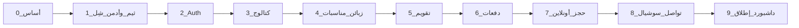

# خطة عمل الإنتاج — استوديو الراية

> إلزامية للمبرمج.  
> **لا تنتقل لمرحلة تالية** قبل إكمال الهيكل + تدفق البيانات + **اختبار يدوي ناجح** وتوقيع بوابة المرحلة.  
> المراجع: [developer-handoff.md](./developer-handoff.md) · [pages-inventory.md](./pages-inventory.md) · [data-model.md](./data-model.md) · [ui-nexlink-spec.md](./ui-nexlink-spec.md)

---

## الأهم على الإطلاق — الحجوزات على التقويم

**أي حجز/موعد له تاريخ يجب أن يظهر في `/admin/calendar`.**

| المصدر | يظهر على التقويم؟ |
|--------|-------------------|
| `EventService` (خدمة مناسبة بتواريخ) | **نعم — إلزامي** |
| مناسبة محوّلة من حجز أونلاين (`BookingRequest` → Event + EventService) | **نعم — إلزامي بعد التحويل** |
| موعد مُضاف من Modal التقويم نفسه | **نعم — إلزامي** |
| طلب حجز `PENDING` لم يُحوَّل بعد | لا (يبقى في Inbox فقط حتى التحويل) |

### قاعدة ذهبية للتقويم
- التقويم ليس شاشة تجميلية — هو **شاشة التشغيل اليومية**.
- إن أُنشئ موعد في DB ولم يظهر على FullCalendar = **فشل المرحلة** (4 أو 5 أو 7 حسب المصدر).
- بعد كل إنشاء/تعديل/تحويل: تحقق يدوياً أن الحدث ظاهر فوراً وبعد Refresh.
- عنوان الحدث واضح: مثلاً `عرس — اسم الزبون` مع الوقت والمكان في التفاصيل.

المراحل المرتبطة مباشرة: **4** (بيانات المواعيد) → **5** (عرض التقويم) → **7** (الحجز الأونلاين يغذي التقويم بعد التحويل).

---

## 0) القانون الذهبي (غير قابل للتفاوض)

1. **لا أزرار صامتة:** كل زر / رابط / أيقونة ظاهرة يجب أن يعمل أو يُخفى. ممنوع `href="#"` أو `console.log` كبديل لوظيفة.
2. **لا هيكل ناقص:** القائمة، الصفحات، النماذج، والـ CRUD المرتبطة بالمرحلة تكتمل داخل المرحلة نفسها.
3. **لا داتا فلو ناقص:** من الواجهة → التحقق → قاعدة MySQL → العرض مرة أخرى — مسار مغلق ومُختبر.
4. **اختبار يدوي بوابة:** بدون نجاح قائمة الاختبار اليدوي لا يُفتح العمل على المرحلة التالية.
5. **مرحلة واحدة في الوقت:** لا تخلط بناء مرحلة 5 بينما 3 غير مختبرة.
6. **وثّق النتيجة:** في نهاية كل مرحلة عبّئ جدول «بوابة المرحلة» أسفل القسم.
7. **أبلغ المدير واتساباً:** بعد كل بوابة اختبار يدوي شغّل `node tools/pm-notify.mjs gate ...` (انظر `docs/whatsapp-pm-notifications.md`). بدون إشعار = المرحلة غير مغلقة إدارياً.

### تعريف «منتهي» لعنصر UI

| الحالة | مسموح؟ |
|--------|--------|
| يعمل بالكامل ويحدّث DB أو ينقّل لصفحة حقيقية | نعم |
| مخفي حتى تُبنى وظيفته في مرحلة لاحقة | نعم (مع تعليق في الكود: `Phase N`) |
| ظاهر لكن لا يفعل شيئاً / modal فارغ / رابط ميت | **لا — رفض المرحلة** |

---

## خريطة المراحل



كل سهم = **اختبار يدوي ناجح + توقيع بوابة**.

---

## المرحلة 0 — تأسيس المشروع وقاعدة البيانات

### الهدف
مشروع Next.js يعمل محلياً + Prisma متصل بـ MySQL + جداول MVP فارغة جاهزة.

### الهيكل المطلوب
```
apps/web/          (أو جذر المشروع حسب اختيار السcaffold)
prisma/schema.prisma
.env               (DATABASE_URL — غير مرفوع)
docs/              (موجود مسبقاً — لا تحذف)
```

### تدفق البيانات
```
.env DATABASE_URL → Prisma Client → MySQL
migrate → جداول حسب docs/data-model.md (الحد الأدنى للكيانات المذكورة في المراحل 1–8)
```

### مخرجات إلزامية
- [x] `npm run dev` يعمل بدون أخطاء
- [x] `prisma migrate` ناجح على MySQL
- [x] `prisma generate` ناجح
- [x] ملف `.env.example` بدون أسرار

### اختبار يدوي — بوابة 0
| # | الاختبار | نتيجة (✓/✗) |
|---|----------|--------------|
| 0.1 | فتح التطبيق على localhost | ✓ |
| 0.2 | الاتصال بـ MySQL عبر Prisma (استعلام بسيط أو Studio) | ✓ |
| 0.3 | الجداول موجودة (Customer, Event, … حسب السكيمة الأولية) | ✓ |

**توقيع المبرمج:** نهلة البستنجي  **التاريخ:** 2026-08-12  
**إشعار واتساب `gate` أُرسل؟** نعم  
**الانتقال للمرحلة 1 مسموح؟** نعم  

تفاصيل الجلسة: [phase-0-completion.md](./phase-0-completion.md)

```bash
node tools/pm-notify.mjs gate --id 0 --pass true --manual-test pass --notes "أساس المشروع وMySQL جاهزان"
```

---

## المرحلة 1 — شِل الأدمن + الثيم (بدون بيانات عمل بعد)

### الهدف
لوحة إدارة بشكل NexLink كاملة الهيكل الظاهر: RTL + Light افتراضي + **زر theme-btn لـ Light/Dark** + شعار الراية + قائمة تنقل **كل روابطها تؤدي لصفحات موجودة** (حتى لو صفحة «قيد المرحلة» مؤقتة فقط إن كانت المرحلة الحالية لا تشملها — **الأفضل:** ابنِ الصفحات الهيكلية الفارغة برسالة واضحة «تُفعَّل في المرحلة X» بدل أزرار ميتة).

### الهيكل
- `app/(admin)/admin/layout.tsx` — shell
- صفحات placeholder مسمّاة لكل بند قائمة MVP (أو إخفاء البنود غير الجاهزة)
- أصول الثيم محلية — انظر `.cursor/rules/theme-setup.mdc`

### تدفق البيانات
```
المستخدم يفتح /admin/* → layout يحمّل CSS/JS الثيم
localStorage ←→ theme-btn (dark/light)
لا كتابة DB بعد في هذه المرحلة إلا إن لزم إعدادات ثابتة
```

### مخرجات إلزامية
- [x] `dir=rtl` + `lang=ar` + `data-theme=light`
- [x] خط الواجهة + primary `#5955D1` — **ملاحظة 2026-08-13:** الخط المعتمد الآن **Cairo** (راجع `admin-tables-ux.mdc`)
- [x] شعار استوديو الراية (ليس NexLink)
- [x] `theme-btn` يعمل ويحفظ التفضيل
- [x] لا طلبات إلى `nexlink.layoutdrop.com`
- [x] السايدبار: روابط MVP ظاهرة وتعمل (صفحات هيكلية برسالة المرحلة؛ الموظفون مؤجّلون حسب التوثيق)

### اختبار يدوي — بوابة 1
| # | الاختبار | نتيجة |
|---|----------|--------|
| 1.1 | الصفحة RTL بالكامل | ✓ |
| 1.2 | Light افتراضي بعد مسح التخزين | ✓ |
| 1.3 | تبديل Light/Dark ثم تحديث الصفحة يحافظ على الاختيار | ✓ |
| 1.4 | الشعار والنص = استوديو الراية | ✓ |
| 1.5 | كل رابط ظاهر في السايدبار يفتح صفحة حقيقية (لا 404 ولا #) | ✓ |
| 1.6 | لا أخطاء أصول CSS/JS ناقصة في الكونسول تتعلق بالثيم | ✓ |

**توقيع:** نهلة البستنجي  **التاريخ:** 2026-08-13  **انتقال؟** نعم  

تفاصيل: [phase-1-completion.md](./phase-1-completion.md)

---

## المرحلة 2 — المصادقة (Auth)

### الهدف
دخول/خروج حقيقي للموظفين مع حماية مسارات `/admin/*`.

### الهيكل
- `/admin/login`
- جلسة آمنة (NextAuth / Better Auth / ما يُعتمد في المشروع)
- مستخدم مدير في الـ seed
- Middleware: غير المسجّل → login

### تدفق البيانات
```
Login form → تحقق من User في MySQL → Session cookie
طلب /admin/* → middleware يفحص الجلسة
Logout → تدمير الجلسة → /admin/login
```

### مخرجات إلزامية
- [x] مستخدم seed: بريد + كلمة مرور موثّقة في README داخلي للمبرمج فقط
- [x] كلمة مرور خاطئة تُظهر خطأ واضح
- [x] بعد الدخول يذهب لـ `/admin` أو التقويم حسب القرار
- [x] زيارة `/admin/events` بدون جلسة تُرفض

### اختبار يدوي — بوابة 2
| # | الاختبار | نتيجة |
|---|----------|--------|
| 2.1 | دخول صحيح | ✓ |
| 2.2 | دخول خاطئ | ✓ |
| 2.3 | حماية المسارات | ✓ |
| 2.4 | تسجيل الخروج | ✓ |
| 2.5 | تحديث الصفحة يبقى مسجّلاً (إن كان مطلوباً) | ✓ |

**توقيع:** نهلة البستنجي  **التاريخ:** 2026-08-13  **انتقال؟** نعم  

تفاصيل: [phase-2-completion.md](./phase-2-completion.md)

---

## المرحلة 3 — الكتالوج (خدمات + باقات)

### الهدف
CRUD كامل للخدمات والعروض/الباقات — أساس الأسعار لاحقاً.

### الهيكل
- `/admin/services` قائمة + إضافة/تعديل/حذف (أو تعطيل)
- `/admin/services/[id]/offers` أو Modal عروض
- لا أزرار «حفظ» بدون كتابة DB

### تدفق البيانات
```
نموذج خدمة → Prisma Service → قائمة تتحدث فوراً
نموذج عرض → Prisma Offer مرتبط بـ serviceId → يظهر تحت الخدمة
حذف/تعطيل → ينعكس في القائمة وفي أي select لاحق
```

### مخرجات إلزامية
- [x] إنشاء / تعديل / عرض / حذف أو أرشفة خدمة
- [x] إنشاء عرض بسعر `Decimal` صحيح
- [x] تحقق حقول فارغة (لا حفظ ناقص)

### اختبار يدوي — بوابة 3
| # | الاختبار | نتيجة |
|---|----------|--------|
| 3.1 | إضافة خدمة تظهر في القائمة بعد الحفظ | ✓ |
| 3.2 | تعديل الاسم ينعكس فوراً | ✓ |
| 3.3 | إضافة باقة بسعر والتحقق من ظهورها | ✓ |
| 3.4 | محاولة حفظ بدون اسم = رفض مع رسالة | ✓ |
| 3.5 | لا زر صامت في شاشة الخدمات | ✓ |

**توقيع:** نهلة البستنجي  **التاريخ:** 2026-08-13  **انتقال؟** نعم  

تفاصيل: [phase-3-completion.md](./phase-3-completion.md)

---

## المرحلة 4 — الزبائن + المناسبات + خدمات المناسبة

### الهدف
دورة التشغيل الأساسية داخل الأدمن (بدون تقويم بعد وبدون حجز أونلاين).

### الهيكل
- `/admin/customers` CRUD كامل
- `/admin/events` قائمة + تفاصيل
- داخل المناسبة: إضافة EventService (خدمة + تواريخ + مكان + سعر)
- تغيير حالة المناسبة (تحضير / عمل / منتهية / ملغية)

### تدفق البيانات
```
Customer CRUD ↔ MySQL
Event(customerId, status, totalPrice) ↔ MySQL
EventService(eventId, serviceId, offerId?, startsAt, endsAt, venue, hall, price)
تحديث totalPrice عند إضافة/تعديل خدمات (قاعدة واضحة في الكود)
```

### مخرجات إلزامية
- [ ] زبون جديد يظهر في القائمة والتفاصيل
- [ ] مناسبة مربوطة بزبون
- [ ] خدمة مناسبة لها تواريخ حقيقية
- [ ] حالات المناسبة تعمل وتظهر في الفلتر
- [ ] كل أزرار التفاصيل (حفظ، إضافة خدمة، تغيير حالة) فعالة

### اختبار يدوي — بوابة 4
| # | الاختبار | نتيجة |
|---|----------|--------|
| 4.1 | إنشاء زبون كامل الحقول الإلزامية | ✓ |
| 4.2 | إنشاء مناسبة للزبون | ✓ |
| 4.3 | إضافة خدمتين بتواريخ مختلفة | ✓ |
| 4.4 | تغيير الحالة إلى قيد العمل ثم منتهية | ✓ |
| 4.5 | فلتر القائمة حسب الحالة | ✓ |
| 4.6 | تحديث الصفحة يحافظ على البيانات | ✓ |

**توقيع:** نهلة البستنجي  **التاريخ:** 2026-08-13  **انتقال؟** نعم  

تفاصيل: [phase-4-completion.md](./phase-4-completion.md)

---

## المرحلة 5 — التقويم (FullCalendar)

### الهدف
عرض وتشغيل المواعيد من `EventService` — **أهم شاشة**.

### الهيكل
- `/admin/calendar`
- عروض: شهر / أسبوع / يوم
- Modal إضافة/تعديل موعد يكتب في DB
- النقر على حدث يفتح تفاصيل حقيقية

### تدفق البيانات
```
EventService ←→ FullCalendar events JSON
إضافة من Modal → إنشاء/تحديث EventService (+ Event/Customer إن لزم حسب التصميم)
سحب/تعديل تاريخ (إن مُفعّل) → تحديث startsAt/endsAt في MySQL → إعادة ظهور صحيحة
```

### مخرجات إلزامية
- [ ] كل EventService يظهر كحدث بعنوان مفهوم (خدمة — زبون)
- [ ] إضافة موعد من التقويم تُنشئ سجلاً حقيقياً **ويظهر على نفس التقويم**
- [ ] مناسبات المرحلة 4 ظاهرة 100٪ على التقويم (لا استثناءات صامتة)
- [ ] RTL + ثيم Light/Dark على صفحة التقويم
- [ ] لا أحداث وهمية ثابتة في الكود بعد الربط
- [ ] بعد Refresh نفس الحجوزات ما زالت ظاهرة

### اختبار يدوي — بوابة 5
| # | الاختبار | نتيجة |
|---|----------|--------|
| 5.1 | **كل** خدمات المناسبة من المرحلة 4 ظاهرة على التقويم بالتاريخ الصحيح | |
| 5.2 | تبديل شهر/أسبوع/يوم يعمل والحجوزات تبقى منطقية | |
| 5.3 | إضافة موعد جديد يظهر فوراً وبعد Refresh | |
| 5.4 | فتح تفاصيل حدث موجود يعرض زبون/مكان/وقت حقيقيين | |
| 5.5 | لا أزرار صامتة (Add Event / التنقل / الإغلاق) | |
| 5.6 | مناسبة بتاريخ معروف — ابحث عنها على التقويم ووجدتها | |

**توقيع:** ________  **التاريخ:** ________  **انتقال؟** نعم / لا  
**إشعار واتساب أُرسل؟** نعم / لا

```bash
node tools/pm-notify.mjs gate --id 5 --pass true --manual-test pass --notes "كل الحجوزات ظاهرة على التقويم فوراً وبعد Refresh"
```

### الهدف
تحصيل مالي كامل للمناسبة مع متبقي صحيح.

### الهيكل
- من تفاصيل المناسبة: قائمة دفعات + إضافة دفعة
- قائمة خصومات + إضافة خصم
- عرض: الإجمالي / الخصم / المدفوع / **المتبقي**

### تدفق البيانات
```
Payment(eventId, amount, paidAt) → Σ payments
Discount(eventId, amount) → Σ discounts
المتبقي = totalPrice - Σ discounts - Σ payments
(يُحسب في الخادم ويُعرض في الواجهة — مصدر واحد للحقيقة)
```

### مخرجات إلزامية
- [ ] إضافة دفعة تحدّث المتبقي فوراً
- [ ] إضافة خصم تحدّث المتبقي فوراً
- [ ] منع مبالغ سالبة أو فارغة
- [ ] بعد Refresh الأرقام نفسها

### اختبار يدوي — بوابة 6
| # | الاختبار | نتيجة |
|---|----------|--------|
| 6.1 | مناسبة بسعر 1000 → دفعة 300 → متبقي 700 | |
| 6.2 | خصم 50 → متبقي 650 | |
| 6.3 | دفعة تغطي الباقي → متبقي 0 | |
| 6.4 | رفض دفعة بمبلغ 0 أو سالب | |
| 6.5 | لا زر حفظ صامت | |

**توقيع:** ________  **التاريخ:** ________  **انتقال؟** نعم / لا

---

## المرحلة 7 — الحجز الأونلاين (لاندينغ + Inbox)

### الهدف
مسار مغلق: زائر يسجّل → الإدارة تحوّل → مناسبة + تقويم.

### الهيكل
- `/` لاندينغ (هوية الراية) مع CTA يعمل
- `/book` + `/book/thanks`
- `/admin/bookings` + تفاصيل
- تحويل: إنشاء Customer + Event + EventService

### تدفق البيانات
```
/book form → BookingRequest(PENDING) → MySQL
Admin bookings list ← BookingRequest
إجراء «تحويل»:
  → Customer + Event(PREPARING) + EventService(تواريخ الطلب)
  → BookingRequest = CONVERTED + ربط IDs
  → يظهر في /admin/events وفي /admin/calendar
رفض → REJECTED مع ملاحظة
```

### مخرجات إلزامية
- [ ] لا إرسال نموذج فارغ
- [ ] الطلب يظهر في الأدمن خلال ثوانٍ
- [ ] التحويل ينشئ بيانات كاملة لا سجلات يتيمة
- [ ] بعد التحويل الموعد على التقويم
- [ ] كل أزرار Inbox (تحويل/رفض/عرض) تعمل

### اختبار يدوي — بوابة 7
| # | الاختبار | نتيجة |
|---|----------|--------|
| 7.1 | إرسال حجز من /book → صفحة شكر | |
| 7.2 | ظهور الطلب في /admin/bookings بحالة PENDING | |
| 7.3 | تحويل الطلب → زبون + مناسبة موجودان | |
| 7.4 | **بعد التحويل الموعد ظاهر على `/admin/calendar` فوراً وبعد Refresh** | |
| 7.5 | رفض طلب آخر يعمل | |
| 7.6 | منع إرسال بدون هاتف/اسم | |
| 7.7 | حجزان محوّلان بتاريخين مختلفين — كلاهما ظاهران على التقويم | |

**توقيع:** ________  **التاريخ:** ________  **انتقال؟** نعم / لا  
**إشعار واتساب أُرسل؟** نعم / لا

```bash
node tools/pm-notify.mjs gate --id 7 --pass true --manual-test pass --notes "بعد التحويل الحجوزات ظاهرة على التقويم"
```

---

## المرحلة 8 — تواصل معنا + سوشيال + واتساب عائم

### الهدف
قناة استفسارات منفصلة عن الحجز + إعدادات موقع حية.

### الهيكل
- `/contact` + `/contact/thanks`
- `/admin/messages` + تفاصيل
- `/admin/settings/site`
- مكوّن واتساب عائم + فوتر سوشيال على الصفحات العامة

### تدفق البيانات
```
/contact → ContactMessage(NEW) → /admin/messages
فتح رسالة → READ
أرشفة → ARCHIVED
Settings.site → whatsapp_number / social_* → تُقرأ في اللاندينغ والفوتر والزر العائم
تغيير الرقم في الإعدادات → الزر العائم يستخدم الرقم الجديد فوراً (بدون إعادة نشر كود)
```

### مخرجات إلزامية
- [ ] رسالة تظهر في الأدمن + عدّاد غير مقروء
- [ ] واتساب العائم يفتح `wa.me` بالرقم من الإعدادات
- [ ] أيقونة سوشيال بلا رابط = مخفية
- [ ] لا خلط بين messages و bookings

### اختبار يدوي — بوابة 8
| # | الاختبار | نتيجة |
|---|----------|--------|
| 8.1 | إرسال /contact → يظهر في messages | |
| 8.2 | تعليم كمقروءة يزيل البادج | |
| 8.3 | تغيير رقم واتساب في الإعدادات يغيّر الزر العائم | |
| 8.4 | رابط إنستغرام يظهر؛ تركه فارغاً يخفي الأيقونة | |
| 8.5 | لا أزرار صامتة في messages أو settings | |

**توقيع:** ________  **التاريخ:** ________  **انتقال؟** نعم / لا

---

## المرحلة 9 — الداشبورد + تثبيت القائمة الكاملة + إطلاق MVP

### الهدف
لوحة مؤشرات حقيقية + إظهار كل روابط MVP النهائية العاملة + مراجعة شاملة.

### الهيكل
- `/admin` بطاقات من DB (طلبات جديدة، رسائل جديدة، مناسبات قيد العمل، تحصيلات…)
- السايدبار النهائي حسب `pages-inventory` MVP — **كل عنصر ظاهر يعمل**
- إعدادات عامة مبسطة إن لزم (عملة، …)

### تدفق البيانات
```
Dashboard aggregates ← COUNT/SUM من MySQL (BookingRequest, ContactMessage, Event, Payment)
روابط البطاقات → الصفحات الفعلية المفلترة
```

### مخرجات إلزامية
- [ ] الأرقام تطابق الواقع بعد عمليات تجريبية
- [ ] جولة كاملة: حجز أونلاين → تحويل → دفعة → تقويم → رسالة تواصل
- [ ] قائمة فحص «لا أزرار صامتة» على كل شاشات MVP

### اختبار يدوي — بوابة 9 (إطلاق)
| # | الاختبار | نتيجة |
|---|----------|--------|
| 9.1 | سيناريو عرسان كامل من اللاندينغ حتى المتبقي 0 **مع ظهور الموعد على التقويم** | |
| 9.2 | سيناريو رسالة تواصل حتى READ | |
| 9.3 | الداشبورد يعكس الأعداد الصحيحة | |
| 9.4 | مرور على كل روابط السايدبار — لا ميت/لا 404 | |
| 9.5 | RTL + Light افتراضي + theme-btn + شعار على الشاشات الحرجة | |
| 9.6 | تجربة موبايل أساسية للاندينغ و/book وواتساب | |
| 9.7 | جولة تقويم: 3 حجوزات على الأقل ظاهرة وصحيحة التواريخ | |

**توقيع المبرمج:** ________  **مراجعة مشرف (إن وجدت):** ________  
**التاريخ:** ________  **MVP جاهز للتسليم؟** نعم / لا

---

## بعد الإطلاق (ليس قبل إغلاق بوابة 9)

| المرحلة | المحتوى | شرط البدء |
|---------|---------|-----------|
| 10 | موظفين / أدوار / مناسباتي | بوابة 9 ✓ |
| 11 | تقارير Excel/PDF | بوابة 9 ✓ |
| 12 | معرض / FAQ / من نحن | بوابة 9 ✓ |
| 13 | POS / SMS / دفع إلكتروني | قرار منتج منفصل |

كل مرحلة لاحقة تتبع **نفس القانون:** هيكل + داتا فلو + اختبار يدوي قبل التالية.

---

## سجل بوابات الإنتاج (ملخص سريع)

| المرحلة | الاسم | تاريخ الإغلاق | المبرمج | الحالة |
|---------|--------|----------------|---------|--------|
| 0 | أساس + MySQL | | | ☐ |
| 1 | ثيم + شِل | | | ☐ |
| 2 | Auth | | | ☐ |
| 3 | كتالوج | | | ☐ |
| 4 | زبائن + مناسبات | | | ☐ |
| 5 | تقويم | | | ☐ |
| 6 | دفعات | | | ☐ |
| 7 | حجز أونلاين | | | ☐ |
| 8 | تواصل + سوشيال | | | ☐ |
| 9 | داشبورد + إطلاق | | | ☐ |

---

## ملاحظات للمبرمج

- إن اكتشفت زرّاً ميتاً أثناء اختبار مرحلة: **أصلحه أو أخفه** قبل التوقيع — لا تؤجّله «لاحقاً» وهو ظاهر.
- إن تغيّر متطلب المنتج: حدّث هذه الخطة ثم نفّذ — لا تكسر ترتيب البوابات صامتة.
- القواعد المساعدة: `.cursor/rules/project-context.mdc` · `theme-setup.mdc` · `prisma-mysql.mdc`
