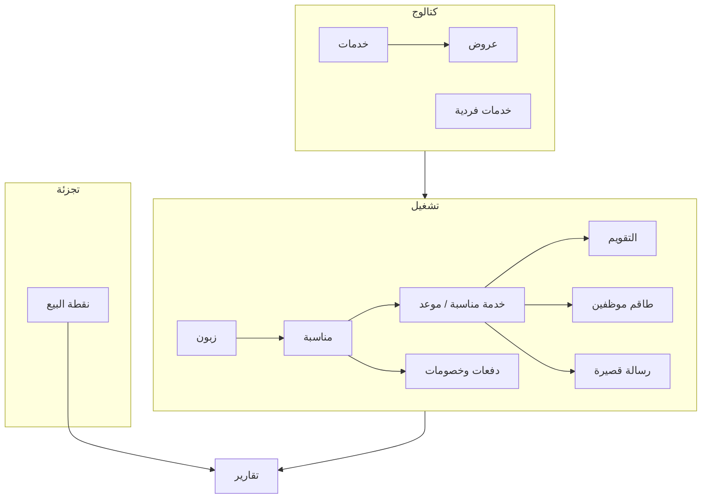

# هيكل نظام وميض (تحليل كامل للديمو) — مرجع استوديو الراية

> تاريخ إعادة التحليل الحي: **2026-08-12**  
> الديمو: https://wameed.mostaqbalsoft.com  
> دخول الاختبار: انظر [wameed-demo-qa.md](./wameed-demo-qa.md)  
> **تحذير:** مرجع وظيفي فقط — لا ننسخ السورس. منتج الراية يُبنى من جديد (Next.js + Prisma + MySQL).

---

## 1) ما هو وميض؟

نظام **SaaS متعدد الاستوديوهات/الفروع** لإدارة استوديو تصوير ومناسبات:

| الطبقة | الموجود في الديمو |
|--------|-------------------|
| تقنية | ASP.NET Core MVC + Identity + jQuery + Bootstrap RTL |
| عزل | Cookies: `SelectedStudioId` · `SelectedBranchId` |
| عملة الديمو | ₪ |
| فروع | فرع 1 · فرع 2 |
| مستخدم التجربة | صابر مدلل — `studio-manage@wameed.com` / `Test@123` |

---

## 2) خريطة القائمة الجانبية (هيكل الواجهة)

كما في الديمو (مجموعة رئيسية → فرعية):

```
الصفحة الرئيسية
لوحة التحكم
  ├── مناسباتي
  ├── الزبائن
  ├── الخدمات
  ├── الخدمات الفردية
  ├── المناسبات
  └── خدمات المناسبات
نقطة البيع
  ├── شاشة البيع
  ├── الأصناف
  ├── المنتجات
  └── طلبات الشراء
التقارير
  ├── تقرير العروض
  ├── تقرير خدمات الموظفين
  ├── تقرير المناسبات
  ├── تقرير الدفعات
  ├── تقرير المصاريف
  ├── تقرير الخصومات
  ├── الرسائل القصيرة          ← سجل SMS (ليست شاشة OTP منفصلة)
  ├── تقرير نقاط البيع
  └── تقرير المنتجات
الموظفين
  ├── الموظفين
  └── الأدوار
الإعدادات
  ├── التعريفات
  └── الإعدادات
```

**أيقونات علوية:** رسائل الاستوديو (`/Admin/StudioMessage/MyMessages`) · التقويم · بحث.

---

## 3) لوحة المؤشرات (Dashboard) — أرقام حية وقت التحليل

| مؤشر | قيمة الديمو |
|------|-------------|
| الموظفين | 3 |
| الزبائن | 6 |
| العروض | 48 |
| الخدمات | 10 |
| الخدمات الإضافية | 4 |
| رصيد الرسائل | **0** |
| مناسبات قيد العمل | 4 |
| مناسبات منتهية | 2 |
| مناسبات ملغية | 0 |
| خدمات قيد العمل | 4 |
| خدمات منتهية | 6 |
| التحصيلات | 3550.00 |
| الخصومات | 360.00 |

+ جدول «المناسبات التي اقترب موعدها» + رسوم شهرية + فلتر سنة.

---

## 4) الوحدات بالتفصيل

### 4.1 الزبائن `/ControlPanel/UserProfile/Customers`
سجل عميل: اسم، هاتف، هاتف إضافي، بريد، عنوان، تاريخ إضافة.

### 4.2 الخدمات `/ControlPanel/Service`
أنواع ظاهرة: عرس، حنا، جبل حنا، عقيقة، كتب كتاب، سهرة شباب، غداء، حمام عريس، فاردة سيارة، جلسة عرسان خارجية…  
لكل خدمة **أنواع/عروض (Offers)** بأسعار.

### 4.3 الخدمات الفردية `/ControlPanel/SubService`
خدمات إضافية بأسعار (كاميرا/برومو/طباعة…).

### 4.4 المناسبات `/ControlPanel/Event`
صف المناسبة: رقم · زبون · هاتف · قائمة الخدمات · سعر · خصم · عمليات (إنهاء…).  
أمثلة: ليث حسون (عرس+حنا) · الياس يوسف…

### 4.5 خدمات المناسبات `/ControlPanel/Event/EventServices` ⭐
هذا قلب التشغيل + التقويم + الطاقم + SMS التشغيلي.

**أعمدة القائمة:**
`#` · الزبون · المناسبة · المدينة · المكان · من تاريخ · الى تاريخ · سعر الخدمة · الأيام الباقية · الحالة

**أمثلة صفوف:**
| زبون | خدمة | مكان | من→إلى | سعر | حالة |
|------|------|------|--------|-----|------|
| ليث حسون | حنا | الماسة / نابلس | 2026-07-22 18:00→20:00 | 1000 | قيد المراجعة |
| ليث حسون | عرس | الماسة | 2026-07-23 20:00→22:00 | 2010 | قيد المراجعة |

**أزرار على الصف:**
- **المشرف** — تغيير مشرف الخدمة (Modal)
- **الموظفين** — تعيين طاقم التغطية (محمد/خليل على عرس أحمد)
- **إرسال رسالة** — SMS للزبون من سياق الخدمة
- **إلغاء / إنهاء** المناسبة/الخدمة

### 4.6 التقويم `/ControlPanel/Event/Calendar`
FullCalendar: شهري / أسبوعي / يومي · سابق/تالي/اليوم.  
المصدر المنطقي: صفوف `EventService` ذات التواريخ.

### 4.7 مناسباتي
مهام الموظف المعيَّن كطاقم على خدمات (راتب/مكافأة/وظيفة/أيام).

### 4.8 الموظفين والأدوار
**موظفون:** صابر مدلل · عبد الرحيم تميمي · أسيد مدلل  
**أدوار في الديمو:**
| الإسم | الوصف |
|--------|--------|
| مصور | مصور |
| مدير الأستوديو | مدير الأستوديو |

### 4.9 نقطة البيع `/PointOfSale/*`
- شاشة البيع: فاتورة · مبيعات الصندوق · رصيد افتتاحي · مبلغ مدفوع · إغلاق الصندوق  
- أصناف / منتجات / طلبات شراء  
- تقرير نقاط البيع + تقرير المنتجات

### 4.10 التقارير المالية/التشغيلية
عروض · خدمات موظفين · مناسبات · دفعات · مصاريف · خصومات · POS · منتجات.

---

## 5) الرسائل القصيرة وموضوع OTP

### ما هو موجود فعلياً في الديمو؟

| العنصر | المسار / المكان | الوظيفة |
|--------|------------------|---------|
| رصيد الرسائل | بطاقة الداشبورد | عداد رصيد (0 في الديمو) |
| سجل الرسائل | `/ControlPanel/SMS` (تحت التقارير) | قائمة: زبون · هاتف · الرسالة · الحالة · تاريخ |
| إرسال من الخدمة | زر «إرسال رسالة» في خدمات المناسبات | رسالة للزبون من سياق الموعد |
| إرسال من ملف موظف | زر «إرسال رسالة» في شاشة الموظفين | تواصل مع رقم الموظف |
| قوالب | Lookup `SMSTemplate` | مثال حي: كود `شكر` → «شكرا لإختيارك ستوديو الوميض» |

### هل وجدنا شاشة OTP؟
**لا.** في جولة 2026-08-12 داخل ControlPanel **لم تظهر** شاشة مستقلة باسم OTP / رمز تحقق للزبون.

ما يظهر هو **SMS تشغيلي** (إشعار/شكر/تواصل)، مع رصيد وقوالب.

| احتمال | التفسير |
|--------|---------|
| OTP لمنصة SaaS | قد يكون لتسجيل استوديو جديد عند مزوّد وميض — **خارج** لوحة ديمو الاستوديو |
| خلط الاسم | «رسائل قصيرة» ≠ OTP بالضرورة |
| غير مفعّل في الديمو | رصيد الرسائل = 0 وقد تكون ميزات ناقصة |

### ماذا ننصح لاستوديو الراية؟
- **MVP الراية:** واتساب عائم + رسائل تواصل عبر `/contact` (موثّق عندكم) — **بدون بناء SMS/OTP كامل** ما لم يطلب المنتج صراحة.  
- إن لزم لاحقاً: قوالب رسائل + سجل إرسال + مزوّد (مثل Wasender) — مرحلة ما بعد بوابة 9.  
- OTP للدخول للأدمن: اختياري أمني؛ ليس شرط تشغيل التقويم/الحجز.

---

## 6) نموذج البيانات المفاهيمي (كما يعمل وميض)

```
Studio
 └── Branch (فرع 1 / فرع 2)
      ├── User + Role          ← طاقم/إدارة (مصور، مدير)
      ├── Customer             ← الزبون (أحمد…)
      ├── Service → Offer
      ├── SubService
      ├── Event
      │    ├── EventService     ← موعد التقويم + مكان + حالة
      │    │    ├── EventServiceEmployee  ← طاقم التغطية (محمد، خليل)
      │    │    └── Supervisor
      │    ├── Payment
      │    └── Discount
      ├── SMS (+ SMSTemplate)
      ├── Product → ProductItem → PurchaseOrder / Sale / CashBox
      ├── Expense
      ├── Lookup / LookupValue
      └── Setting (Currency, pagination_no, Close_Events_Day, Upload_Event_On_Youtube_Price)
```

**معادلة المناسبة:**  
`المتبقي = سعر المناسبة − الخصومات − الدفعات`

---

## 7) دورة العمل الكاملة

```
1. تعريف خدمات + عروض + خدمات فردية
2. إضافة زبائن
3. إنشاء مناسبة وربط خدمات بتواريخ/مكان
4. تعيين طاقم (موظفين) + مشرف على كل خدمة
5. إرسال SMS اختياري للزبون
6. دفعات وخصومات حتى المتبقي 0
7. إنهاء/إلغاء الخدمات والمناسبة
8. (اختياري) بيع من POS
9. تقارير + متابعة رصيد الرسائل
```



---

## 8) مسارات مهمة للاختبار اليدوي

| الغرض | رابط |
|--------|------|
| دخول | `/Identity/Account/Login` |
| داشبورد | `/ControlPanel` |
| مناسبات | `/ControlPanel/Event` |
| خدمات مناسبات + طاقم + SMS | `/ControlPanel/Event/EventServices` |
| تقويم | `/ControlPanel/Event/Calendar` |
| مناسباتي | `/ControlPanel/EventServiceEmployee/GetEmployeeEventServices` |
| موظفين | `/ControlPanel/UserProfile` |
| أدوار | `/ControlPanel/Role` |
| سجل SMS | `/ControlPanel/SMS` |
| قوالب SMS | `/ControlPanel/Lookup/Details/9` (SMSTemplate) |
| إعدادات | `/ControlPanel/Setting` |
| POS | `/PointOfSale/SaleScreen` |
| تقرير طاقم | `/ControlPanel/Report/GetEmployeeServiceReport` |

تفاصيل الدخول: [wameed-demo-qa.md](./wameed-demo-qa.md)

---

## 9) ماذا نأخذ / ماذا نترك لاستوديو الراية؟

| من وميض | قرار الراية |
|---------|-------------|
| مناسبات + خدمات بتاريخ + تقويم | **إلزامي MVP** |
| زبائن + دفعات + خصومات | **إلزامي MVP** |
| طاقم على الخدمة (EventServiceEmployee) | مفهوم مهم — شاشات كاملة غالباً **بعد MVP** (مرحلة 10) |
| حجز أونلاين للعريس | **جديد عندنا** (وميض ديمو إداري أساساً) |
| SMS تشغيلي / OTP | **ليس MVP** إلا بقرار منتج |
| POS كامل | **لاحق** (مرحلة 13) |
| تعدد فروع/استوديوهات SaaS | غير مطلوب في MVP راية واحد |

---

## 10) خلاصة للمعماري

وميض = **تشغيل استوديو**: كتالوج → زبون → مناسبة → مواعيد على تقويم → طاقم يغطي الموعد → مال → تقارير، مع **SMS تشغيلي اختياري** و**POS**.  

OTP كمنتج تحقق هوية **غير ظاهر** كوحدة مستقلة في ديمو ControlPanel؛ الموجود هو سجل/قوالب رسائل قصيرة.  

مرجع أقدم مكمّل: [wameed-system-analysis.md](./wameed-system-analysis.md)
