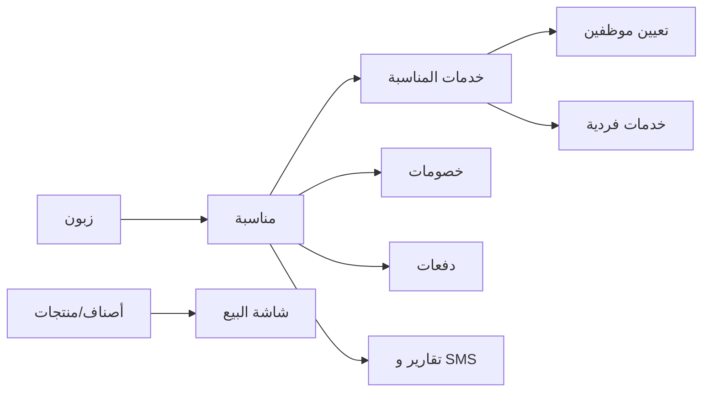

# تحليل نظام وميض (Wameed) — مرجع تطوير استوديو الراية

> تاريخ التحليل: 2026-08-08  
> مصدر الديمو: [https://wameed.mostaqbalsoft.com](https://wameed.mostaqbalsoft.com)  
> المنتج: وميض — نظام إدارة استوديوهات التصوير (Mostaqbal Soft)  
>  
> **للمبرمج:** ابدأ من [README.md](./README.md) ثم [developer-handoff.md](./developer-handoff.md). هذا الملف مرجع وظيفي فقط (منطق وميض)، وليس مواصفات التنفيذ النهائية.

---

## 1. نظرة عامة

وميض نظام ويب SaaS لإدارة استوديو تصوير/مناسبات: حجوزات، خدمات، زبائن، موظفين، دفعات، نقطة بيع، تقارير، ورسائل SMS.

| البند | القيمة |
|--------|--------|
| اسم الديمو | وميض - ديمو |
| الشركة | Mostaqbal Soft (طولكرم) |
| سنة الواجهة | © 2022 |
| العملة في الديمو | ₪ |
| الفروع | فرع 1، فرع 2 |
| مستخدم الديمو | صابر مدلل (`studio-manage@wameed.com`) |

الشعار التسويقي: شريك يومي في إدارة استوديو التصوير — يوفر الوقت ويزيد الاحترافية أمام العملاء.

---

## 2. التقنية (Tech Stack)

| الطبقة | التقنية |
|--------|---------|
| Backend | ASP.NET Core MVC |
| المصادقة | ASP.NET Identity (Cookie + AntiForgery) |
| Frontend | jQuery + Bootstrap + CSS RTL |
| رسوم بيانية | Chart.js + Google Charts |
| تقويم | FullCalendar 5.7 |
| محرر نصوص | TinyMCE 8 |
| إشعارات | Toastr |
| واجهات مساعدة | Chosen, Moment.js, daterangepicker, jQuery UI |
| تصدير | Excel / PDF / طباعة (مذكور على الموقع) |

### مؤشرات تقنية من الديمو

- مسارات `/lib/` و `/js/site.js` بنمط ASP.NET Core الافتراضي
- نموذج Logout عبر `/Identity/Account/Logout`
- `__RequestVerificationToken` في النماذج
- Cookies متعددة المستأجرين:
  - `SelectedStudioId`
  - `SelectedBranchId`

---

## 3. هيكل المسارات (Areas / Controllers)

### 3.1 لوحة التحكم — `/ControlPanel`

| المسار | الوظيفة |
|--------|---------|
| `/ControlPanel` | الصفحة الرئيسية / لوحة المؤشرات |
| `/ControlPanel/Event` | المناسبات |
| `/ControlPanel/Event/EventServices` | خدمات المناسبات |
| `/ControlPanel/Event/Calendar` | التقويم |
| `/ControlPanel/Event/Search` | بحث المناسبات |
| `/ControlPanel/Service` | الخدمات |
| `/ControlPanel/SubService` | الخدمات الفردية |
| `/ControlPanel/UserProfile` | الموظفين |
| `/ControlPanel/UserProfile/Customers` | الزبائن |
| `/ControlPanel/EventServiceEmployee/GetEmployeeEventServices` | مناسباتي (مهام الموظف) |
| `/ControlPanel/Role` | الأدوار |
| `/ControlPanel/Lookup` | التعريفات |
| `/ControlPanel/Setting` | الإعدادات |
| `/ControlPanel/SMS` | الرسائل القصيرة |
| `/ControlPanel/Report/*` | التقارير |

### 3.2 نقطة البيع — `/PointOfSale`

| المسار | الوظيفة |
|--------|---------|
| `/PointOfSale/SaleScreen` | شاشة البيع |
| `/PointOfSale/Product` | الأصناف |
| `/PointOfSale/ProductItem` | المنتجات |
| `/PointOfSale/ProductItem/PurchaseOrders` | طلبات الشراء |

### 3.3 أخرى

| المسار | الوظيفة |
|--------|---------|
| `/Identity/Account/*` | تسجيل الدخول / الملف / كلمة المرور |
| `/Home/SetBranch` | تبديل الفرع |
| `/Home/SetStudio` | تبديل الاستوديو |
| `/Admin/StudioMessage/MyMessages` | رسائل الاستوديو |

---

## 4. الوحدات الوظيفية

### 4.1 الصفحة الرئيسية (Dashboard)

بطاقات مؤشرات:

- الموظفين، الزبائن، العروض، الخدمات، الخدمات الإضافية
- رصيد الرسائل
- المناسبات: قيد العمل / منتهية / ملغية
- الخدمات: قيد العمل / منتهية / ملغية
- التحصيلات، الخصومات
- جدول: المناسبات التي اقترب موعدها
- رسوم: مبيعات المناسبات لكل شهر، المناسبات لكل شهر
- فلتر سنة (2025 / 2026)

أيقونات علوية: رسائل، تقويم، بحث.

### 4.2 الزبائن

أعمدة القائمة:

| الحقل | مثال |
|--------|------|
| الإسم | ليث حسون |
| رقم الهاتف | 972569592395 |
| رقم الهاتف الإضافي | — |
| البريد الإلكتروني | اختياري |
| العنوان | نابلس - بيت امرين |
| أضيف بتاريخ | datetime |

### 4.3 الخدمات (Service)

أنواع ظاهرة في الديمو:

- عرس، حنا، جبل حنا، عقيقة، كتب كتاب
- سهرة شباب، غداء، حمام عريس
- فاردة سيارة للعرسان
- جلسة عرسان خارجية

أعمدة: الإسم | النوع (مناسبة / جلسة) | أضيف بتاريخ | العمليات  
لكل خدمة رابط **الأنواع** (باقات/عروض حسب نوع الخدمة).

### 4.4 أنواع الخدمة / العروض (Offers)

تقرير العروض يعرض:

| الحقل | الوصف |
|--------|--------|
| الإسم | اسم العرض |
| نوع الخدمة | نساء فقط / رجال فقط / مختلط / غير مختلط / عريس وعروس… |
| الخدمة | الخدمة الأب |
| السعر | سعر العرض |
| الوصف | تفاصيل العرض |

### 4.5 الخدمات الفردية (SubService)

| الإسم | النوع | السعر |
|--------|--------|--------|
| برومو | برومو | 600 |
| كاميرا فوتو | كاميرا | 400 |
| كاميرا فيديو | كاميرا | 400 |
| طباعة | صور | 3 |

أعمدة إضافية: لديه عدد | أضيف بتاريخ | العمليات

### 4.6 المناسبات (Event) — قلب النظام

أعمدة القائمة:

| # | الزبون | الهاتف | الخدمات | سعر المناسبة | الخصم | المدفوع | المتبقي | الحالة |

حالات المناسبة:

| القيمة | الحالة |
|--------|--------|
| 1 | قيد التحضير |
| 4 | قيد العمل |
| 6 | ملغية |
| 7 | منتهية |

فلاتر: زبون، حالة، بحث نصي.

عمليات الصف (أيقونات):

- تفاصيل المناسبة
- طباعة
- إضافة (خدمات/عناصر)
- خصم
- دفعة
- حذف / إنهاء المناسبة

#### نموذج إضافة مناسبة (Modal `CreateEvent`)

حقول إلزامية/ظاهرة:

1. رقم الهاتف *
2. الإسم الأول *
3. إسم العائلة *
4. رقم الهاتف الإضافي
5. العنوان *
6. الجنس * (ذكر / أنثى)
7. الخدمة *
8. نوع الخدمة *
9. اسم المكان *
10. اسم القاعة *
11. من تاريخ *
12. إلى تاريخ *
13. خدمات أخرى

دالة الواجهة: `ShowAddEvent(0)`

#### Modals مرتبطة بالمناسبة

- `EventDetailsData` — التفاصيل
- `EventDiscounts` / `CreateDiscount` / `EditDiscount` / `DetailsDiscount`
- `EventPayments` / `CreatePayment` / `EditPayment` / `DetailsPayment`
- `send_sms_modal` / `contact_customer_modal`
- تأكيدات: إلغاء / إنهاء / موافقة / حذف

### 4.7 خدمات المناسبات (Event Services)

كل خدمة داخل مناسبة لها سجل منفصل:

| الحقل | الوصف |
|--------|--------|
| # | رقم المناسبة |
| الزبون | اسم الزبون |
| المناسبة | نوع الخدمة (عرس، حنا…) |
| المدينة | عنوان/مدينة |
| المكان | قاعة / بيت… |
| من تاريخ / الى تاريخ | فترة الخدمة |
| سعر الخدمة | سعر هذه الخدمة |
| الأيام الباقية | عدّاد أو «إنتهت» |
| الحالة | حالة تنفيذ الخدمة |

حالات خدمات المناسبة (من روابط الداشبورد):

| Status | المعنى |
|--------|--------|
| 1 | قيد العمل |
| 4 | ملغية |
| 5 | منتهية |
| (قيد المراجعة) | ظاهرة في القائمة |

### 4.8 مناسباتي (Employee Event Services)

شاشة الموظف المعيّن على الخدمات:

| الزبون | الهاتف | المشرف | المناسبة | الراتب | المكافئة | الوظيفة | الأيام الباقية |

مثال: مصور معيّن على «حنا» براتب 200.

### 4.9 التقويم

FullCalendar يعرض أحداث بصيغة:

```json
{ "title": "عرس", "start": "2026-02-13T18:00", "end": "2026-02-13T20:00", "id": 1 }
```

### 4.10 نقطة البيع (POS)

**الأصناف (Product):** إطارات (فعال)

**المنتجات (ProductItem):**

| الإسم | الصنف | السعر | الكمية |
|--------|--------|--------|--------|
| إطار ذهبي | إطارات | 10 | 9 |
| إطار أبيض مودرن | إطارات | 8 | 4 |

**شاشة البيع:**

- تبويبات أصناف/منتجات
- باركود (keydown listener)
- رصيد افتتاحي
- إغلاق الصندوق (`CloseBox`, `paidAmount`, `openingCashBalance`)
- حالة الصندوق: `status` (1 = مفتوح للبيع)

**طلبات الشراء:**

| الصنف | المنتج | السعر | سعر القطعة | الكمية | البائع | التاريخ | تاريخ الإنتهاء |

يدعم تسجيل دفعة دين على الطلب.

### 4.11 الموظفين والأدوار

**الموظفون في الديمو:**

| الإسم | الإيميل |
|--------|---------|
| صابر مدلل | studio-manage@wameed.com |
| عبد الرحيم تميمي | employee1@wameed.com |
| أسيد مدلل | employee2@wameed.com |

**الأدوار:**

- مدير الأستوديو
- مصور

### 4.12 التقارير

| التقرير | المسار |
|---------|--------|
| تقرير العروض | `/ControlPanel/Report/GetOfferReport` |
| تقرير خدمات الموظفين | `/ControlPanel/Report/GetEmployeeServiceReport` |
| تقرير المناسبات | `/ControlPanel/Report/GetEventReport` |
| تقرير الدفعات | `/ControlPanel/Report/GetPaymentReport` |
| تقرير المصاريف | `/ControlPanel/Report/GetExpenseReport` |
| تقرير الخصومات | `/ControlPanel/Report/GetDiscountReport` |
| تقرير نقاط البيع | `/ControlPanel/Report/PointOfSaleReport` |
| تقرير المنتجات | `/ControlPanel/Report/ProductsReport` |

### 4.13 الرسائل القصيرة (SMS)

- رصيد رسائل على الداشبورد
- قائمة: الزبون | الهاتف | الرسالة | الحالة | التاريخ
- تعريفات: `SMSTemplate`
- تواصل مع الزبون من المناسبة

### 4.14 الإعدادات والتعريفات

**Lookups:**

| الكود | الإسم |
|--------|--------|
| SMSTemplate | نماذج الرسائل |
| SubServiceType | نوع الخدمات الفرعية |
| ServiceType | نوع الخدمة |
| Gender | الجنس |

**Settings:**

| الكود | القيمة | المعنى |
|--------|--------|--------|
| Currency | ₪ | العملة |
| pagination_no | 10 | عناصر الصفحة |
| Close_Events_Day | 4 | أيام إغلاق/تنبيه المناسبات |
| Upload_Event_On_Youtube_Price | 150 | سعر خدمة رفع يوتيوب |

---

## 5. نموذج البيانات المفاهيمي

```
Studio
  └── Branch
        ├── UserProfile (موظف / زبون — يميّز بالدور/النوع)
        ├── Role + Permissions
        ├── Service
        │     └── ServiceType / Offer (سعر + وصف + جمهور)
        ├── SubService (خدمات فردية بأسعار)
        ├── Event (مناسبة)
        │     ├── EventService (خدمة داخل المناسبة + تواريخ + مكان + حالة)
        │     │     └── EventServiceEmployee (تعيين موظف + راتب + مكافأة)
        │     ├── Payment
        │     └── Discount
        ├── Product (صنف)
        │     └── ProductItem (منتج + كمية + سعر)
        │           └── PurchaseOrder
        ├── Sale / CashBox (نقطة البيع)
        ├── SMS / SMSTemplate
        ├── Expense
        ├── Lookup (+ LookupValues)
        └── Setting (key/value)
```

### علاقات أساسية

- الزبون 1—* المناسبات
- المناسبة 1—* خدمات المناسبة
- خدمة المناسبة *—* الموظفين (عبر EventServiceEmployee)
- المناسبة 1—* الدفعات / الخصومات
- الخدمة 1—* أنواع/عروض
- الصنف 1—* المنتجات

### معادلات مالية للمناسبة

```
المتبقي = سعر المناسبة - الخصم - المدفوع
```

---

## 6. دورة العمل (Business Flow)

```
1) تعريف الخدمات + أنواعها + الخدمات الفردية
2) إضافة زبون (أو تلقائياً عند إنشاء مناسبة برقم هاتف)
3) إنشاء مناسبة + اختيار خدمات/باقات + مكان/قاعة/تواريخ
4) تعيين موظفين على خدمات المناسبة (راتب/مكافأة)
5) تسجيل دفعات وخصومات
6) متابعة الحالة: تحضير → عمل → إنهاء / إلغاء
7) (اختياري) بيع منتجات من POS
8) تقارير + SMS للزبائن/الموظفين
```



---

## 7. قائمة التنقل الكاملة (Sidebar)

```
الصفحة الرئيسية
لوحة التحكم
  ├── مناسباتي
  ├── الزبائن
  ├── الخدمات
  ├── الخدمات الفردية
  ├── المناسبات
  └── خدمات المناسبات
نقطة البيع
  ├── شاشة البيع
  ├── الأصناف
  ├── المنتجات
  └── طلبات الشراء
التقارير
  ├── تقرير العروض
  ├── تقرير خدمات الموظفين
  ├── تقرير المناسبات
  ├── تقرير الدفعات
  ├── تقرير المصاريف
  ├── تقرير الخصومات
  ├── الرسائل القصيرة
  ├── تقرير نقاط البيع
  └── تقرير المنتجات
الموظفين
  ├── الموظفين
  └── الأدوار
الإعدادات
  ├── التعريفات
  └── الإعدادات
```

---

## 8. ملاحظات للتطوير على استوديو الراية

### الوضع الحالي للمستودع

| المسار | الحالة |
|--------|--------|
| `Alray Studio/` | فارغ — لا يوجد سورس بعد |
| ديمو المتصفح | مرجع وظائف فقط (لا سورس محلي) |
| `Project/alwammed/odoo` | مشروع Odoo 18 منفصل — ليس هذا الديمو |

### خيارات التنفيذ

1. **بناء نظام جديد** بنفس منطق وميض (موصى به إن لا يوجد سورس/ترخيص)
2. **ترخيص وتخصيص وميض** من Mostaqbal Soft
3. **استخراج متطلبات** من هذا المستند وبناء مخصص لاستوديو الراية

### أولويات وحدات يجب تغطيتها لأي نسخة لاستوديو الراية

1. الزبائن + المناسبات + خدمات المناسبة (Core)
2. الباقات/الأسعار + الدفعات والخصومات
3. تعيين المصورين والموظفين
4. التقويم والتنبيهات
5. التقارير المالية
6. POS (إن كان الاستوديو يبيع إطارات/طباعة)
7. SMS (اختياري)
8. الفروع والصلاحيات

### تخصيصات متوقعة لاسم العميل

- الهوية: استوديو الراية (بدل وميض)
- أنواع المناسبات/الباقات حسب قائمة أسعارهم
- العملة والفروع الفعلية
- الأدوار والصلاحيات لفريقهم
- تقارير مخصصة إن طلبوها

---

## 9. مصادر خارجية

- موقع المنتج: [wameed.mostaqbalsoft.com](https://wameed.mostaqbalsoft.com)
- الشركة: [mostaqbalsoft.com](https://mostaqbalsoft.com)
- تواصل الشركة (من صفحة وميض): mostaqbal.soft@gmail.com — +972592269185

---

## 10. سجل التوثيق

| التاريخ | الإجراء |
|---------|---------|
| 2026-08-08 | تحليل الديمو من المتصفح وتوثيق الوحدات والمسارات ونموذج البيانات |
